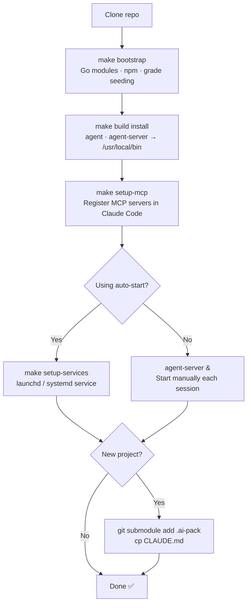

# AI-Pack Installation Guide

## Setup Flow



---

## Prerequisites

| Tool | Minimum | Notes |
|------|---------|-------|
| Go | 1.24+ | `go install` builds all binaries |
| C compiler (gcc/clang) | any | Required by CGO (go-kuzu, go-tree-sitter) |
| Node.js | 18+ | GUI only — skip if not using the web UI |
| Python 3 | 3.10+ | Setup scripts and grade seeding |
| Git | 2.x | Submodule support |

**macOS:** Install Xcode Command Line Tools for the C compiler:
```bash
xcode-select --install
```

**Linux:** Install build essentials:
```bash
sudo apt install build-essential git  # Debian/Ubuntu
sudo dnf install gcc git              # Fedora/RHEL
```

---

## 1. Clone the Repository

```bash
git clone https://github.com/Cortexa-LLC/ai-pack
cd ai-pack
```

---

## 2. Bootstrap (First Time Only)

Installs Go modules, GUI npm dependencies, and seeds model performance grades from LiveBench:

```bash
make bootstrap
```

This fetches LiveBench CSV data (no API key needed) and writes grade files to
`~/.claude/performance_grades/`. These drive the adaptive model selector.

---

## 3. Build and Install Binaries

```bash
make build install
```

This installs:

**Binaries** (to `/usr/local/bin/`):
| Binary | Purpose |
|--------|---------|
| `agent` | CLI used by orchestrators to spawn and monitor agents |
| `agent-server` | Local A2A server that executes agent tasks |
| `kg` | Knowledge graph CLI for codebase indexing |

**Configuration** (to `~/.ai-pack/config.json`):
- Server URL (default: `http://localhost:8080`)
- API settings (model, timeouts)
- Logging configuration
- Metrics settings

The config file is created automatically if it doesn't exist. All components (agent CLI, agent-server, GUI) read from this single source of truth.

> **Note:** `make install` requires write access to `/usr/local/bin/`. Use `sudo make install`
> if needed, or override the prefix: `PREFIX=~/.local make install`.

### Configuration Files

AI-Pack uses `~/.ai-pack/config.json` as the single source of truth for all settings.

**View current configuration:**
```bash
python3 scripts/init-config.py --show
```

**Reset to defaults:**
```bash
python3 scripts/init-config.py --force
```

**Edit manually:**
```bash
vim ~/.ai-pack/config.json
```

**Override with environment variables:**
```bash
export AIPACK_AGENT_SERVER_PORT=9090
export ANTHROPIC_MODEL=claude-opus-4-7
export AIPACK_AGENT_SERVER_LOG_LEVEL=debug
```

Environment variables take highest priority and override the config file.

---

## 4. Register MCP Servers

Register the `kg` MCP server globally so Claude Code can query the knowledge graph:

```bash
make setup-mcp
```

This updates `~/.claude/settings.json`. To register per-project instead:

```bash
make setup-mcp-local
```

**Restart Claude Code** after running this so the new MCP server is picked up.

---

## 5. Auto-Start Services (Optional)

Install background services so `agent-server` starts automatically at login:

```bash
make setup-services
```

**macOS:** Installs launchd plists to `~/Library/LaunchAgents/` for:
- `com.cortexa.ai-pack.agent-server` — AI-Pack agent server
- `com.cortexa.ai-pack.gui` — GUI dev server

**Linux:** Installs systemd user services.

Without this, start the server manually before spawning agents:
```bash
agent-server &
```

Check service status:
```bash
make status-services
```

---

## Verify the Installation

```bash
agent --version          # Agent CLI
agent-server --version   # A2A server
kg --version             # Knowledge graph CLI
```

Start the server and verify it responds:
```bash
agent-server &
curl -s http://localhost:8080/health | jq .
```

---

## Adding AI-Pack to a New Project

Once installed, add the framework to any project as a git submodule:

```bash
cd your-project

# 1. Add the submodule
git submodule add https://github.com/Cortexa-LLC/ai-pack .ai-pack
git submodule update --init --recursive

# 2. Create local workspace
mkdir -p .ai/tasks

# 3. Copy the bootstrap CLAUDE.md template
cp .ai-pack/templates/CLAUDE.md ./CLAUDE.md
# Edit CLAUDE.md: fill in project name, working directory, tech stack, key files

# 4. Commit
git add .ai-pack CLAUDE.md
git commit -m "Add ai-pack framework"
```

> **Critical:** Fill in `CLAUDE.md` before spawning any agent. The working directory
> and task packet path in task descriptions are parsed by the agent server — they
> must be accurate or agents cannot find their contracts. See `CLAUDE.md` for the exact
> format.

---

## Updating

### Update binaries after pulling new code

```bash
git pull
make build install
```

### Update the submodule in a project

```bash
cd your-project
git submodule update --remote .ai-pack
git add .ai-pack
git commit -m "Update ai-pack framework"
```

### Refresh performance grades after a new LiveBench release

```bash
# In the ai-pack repo
python3 scripts/seed-grades.py
```

---

## Uninstall

```bash
make uninstall-services   # Remove auto-start services
sudo make uninstall        # Remove binaries from /usr/local/bin
```

---

## Troubleshooting

**`CGO_ENABLED` build errors**
The knowledge graph binary requires CGO. Ensure a C compiler is installed and `CC` is set:
```bash
which gcc || which clang
CGO_ENABLED=1 make build-kg
```

**`agent-server` not found by `agent` CLI**
The CLI expects `agent-server` in `PATH`. Confirm installation:
```bash
which agent-server
```

**MCP server not appearing in Claude Code**
Re-run `make setup-mcp` and fully restart Claude Code (quit and reopen — reload alone is not enough).

**Performance grades missing**
```bash
python3 scripts/seed-grades.py
```

**Orphaned tasks after server restart**
Reset stalled tasks to `open` (not `queued`):
```bash
agent update -s open <task-id>
```
