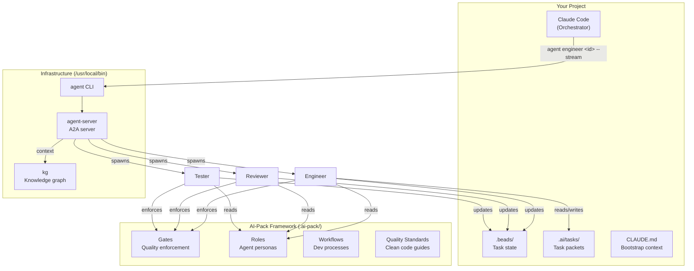
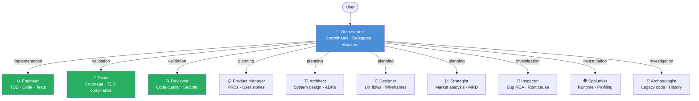
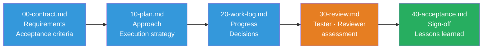
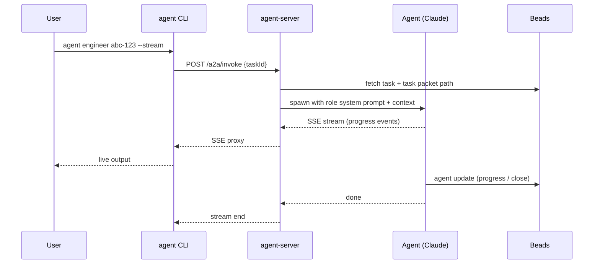
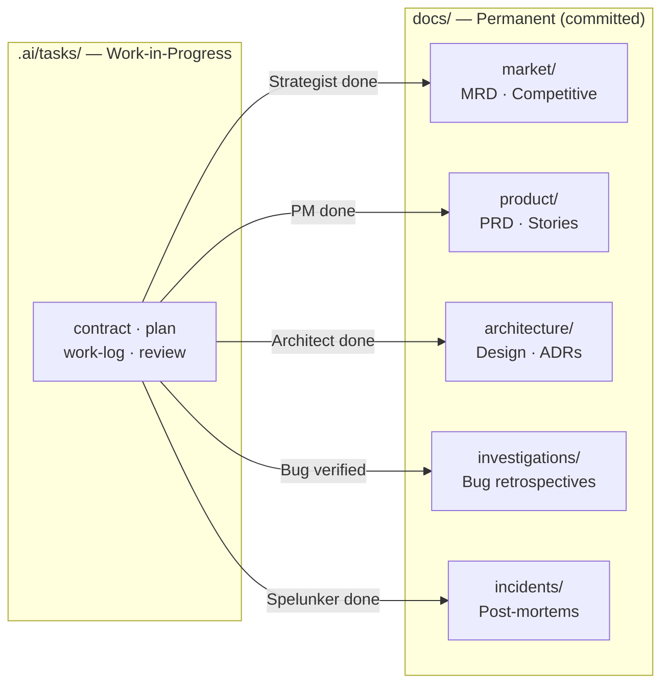
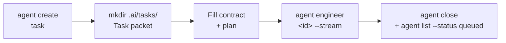
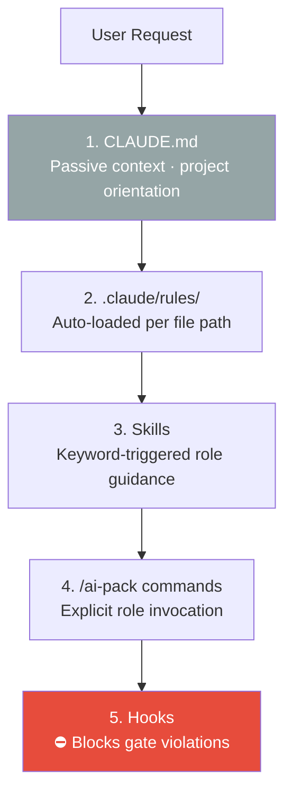

# AI-Pack

<p align="center">
  
</p>

**A comprehensive AI agent workflow framework for software development**

📚 **[View Full Documentation](https://cortexa-llc.github.io/ai-pack/)** · 📦 **[Installation Guide](INSTALL.md)** · 🔧 **[Troubleshooting](docs/TROUBLESHOOTING.md)**

AI-Pack provides structured processes, quality gates, agent roles, and coding standards for AI agent-based software development. It ensures quality, consistency, and proper governance throughout the development lifecycle.

---

## Overview

AI-Pack is designed as a git submodule that projects include at `.ai-pack/`. It provides:



1. **AI Workflow Framework** - Structured processes for AI agent-based development
   - Quality gates (enforcement rules)
   - Agent roles (orchestrator, engineer, reviewer, etc.)
   - Development workflows (feature, bugfix, refactor, research)
   - Task packet templates (contract, plan, work-log, review, acceptance)

2. **Clean Code Standards** - Industry-leading coding principles and practices
   - Universal design principles (SOLID, DRY, YAGNI, etc.)
   - Language-specific guidelines (C++, Python, JavaScript/TypeScript, Java, Kotlin)
   - Testing best practices and TDD workflow
   - Architecture patterns and refactoring techniques

These components work together seamlessly with AI coding assistants like Claude Code through `.ai-pack` integration.

---

## AI Workflow Framework

The AI Workflow Framework provides structured processes, roles, and templates for AI agent-based software development.

### Framework Components

#### 🚦 Gates - Quality Controls
Quality gates define rules and constraints that govern what actions are permitted. Located in `gates/`:

- **[00-global-gates.md](gates/00-global-gates.md)** - Universal rules (safety, TDD, quality, communication)
- **[05-tdd-enforcement.md](gates/05-tdd-enforcement.md)** - **MANDATORY, BLOCKING** Test-Driven Development enforcement (RED-GREEN-REFACTOR cycle, test pyramid)
- **[06-beads-enforcement.md](gates/06-beads-enforcement.md)** - **MANDATORY, BLOCKING** task memory system usage (all task operations must use bd commands)
- **[10-persistence.md](gates/10-persistence.md)** - File operations and state management rules
- **[20-tool-policy.md](gates/20-tool-policy.md)** - Tool usage policies and approvals
- **[25-execution-strategy.md](gates/25-execution-strategy.md)** - **MANDATORY** execution strategy analysis and parallel engineer enforcement
- **[30-verification.md](gates/30-verification.md)** - Verification and validation requirements
- **[35-code-quality-review.md](gates/35-code-quality-review.md)** - **MANDATORY** Tester and Reviewer validation for all code changes
- **[40-architectural-review.md](gates/40-architectural-review.md)** - Architectural review for significant system changes

#### 👥 Roles - Agent Personas
Roles define different agent personas with specific responsibilities. Located in `roles/`:



- **[orchestrator.md](roles/orchestrator.md)** - High-level coordinator, delegates work, monitors progress
  - **ENFORCED:** Automatically analyzes and applies parallel execution for 3+ independent subtasks (max 5 concurrent)
  - **MANDATORY:** Must complete execution strategy analysis before delegation (enforced by [Execution Strategy Gate](gates/25-execution-strategy.md))
  - **MANDATORY:** Must delegate to Tester and Reviewer for all code changes (enforced by [Code Quality Review Gate](gates/35-code-quality-review.md))
- **[engineer.md](roles/engineer.md)** - Implementation specialist, writes code, creates tests
  - **MANDATORY:** Must follow Test-Driven Development (TDD) RED-GREEN-REFACTOR cycle
  - Executes specific tasks following TDD workflow and established patterns
- **[inspector.md](roles/inspector.md)** - Bug investigation specialist, conducts root cause analysis
  - **Investigates:** Bug reports, reproduces issues, identifies root cause via static code analysis
  - **Delivers:** RCA document, task packet for Engineer, regression test specifications
  - **Optional:** Invoked by Orchestrator for complex bugs or directly by user
- **[spelunker.md](roles/spelunker.md)** - Runtime investigation specialist, explores live systems
  - **Investigates:** Production issues, runtime behavior, performance problems, unfamiliar live systems
  - **Explores:** Execution paths, deep call stacks, obscure dependencies, runtime state
  - **Delivers:** Runtime investigation report, execution traces, dependency maps, incident reports
  - **Optional:** Invoked by Orchestrator for production/runtime issues or directly by user
- **[strategist.md](roles/strategist.md)** - Market analysis and business strategy specialist
  - **Analyzes:** Market opportunity, competitive landscape, business case, strategic positioning
  - **Delivers:** MRD (Market Requirements Document), competitive analysis, business case, strategic recommendations
  - **Collaborates:** Hands off market requirements to Product Manager for detailed product definition
  - **Optional:** Invoked by Orchestrator for new products, major features with market implications, or business case validation
- **[product-manager.md](roles/product-manager.md)** - Requirements specialist, creates PRDs and user stories
  - **Defines:** Product requirements, success metrics, epics and user stories (JIRA-style)
  - **Collaborates:** Works with Engineers and Architect on technical feasibility and breakdown
  - **Delivers:** PRD, epics, user stories with acceptance criteria
  - **Optional:** Invoked by Orchestrator for large features or directly by user
- **[designer.md](roles/designer.md)** - UX specialist, creates user flows and wireframes for value stream delivery
  - **Designs:** User workflows, journey maps, wireframes (HTML for web/iOS/Android), design specifications
  - **Collaborates:** Works with Product Manager on requirements, Architect on feasibility
  - **Delivers:** User research, user flows, wireframes, design specs, accessibility requirements
  - **Optional:** Invoked by Orchestrator for user-facing features with significant UI/UX work
- **[architect.md](roles/architect.md)** - Technical design specialist, system architecture and design
  - **Designs:** System architecture, API specifications, data models, technology choices
  - **Collaborates:** Works with Product Manager and Designer on feasibility, Engineers on implementation
  - **Delivers:** Architecture documents, API specs, data models, ADRs
  - **Optional:** Invoked by Orchestrator for complex features requiring architectural design
- **[archaeologist.md](roles/archaeologist.md)** - Legacy code investigation specialist, reconstructs historical context
  - **Studies:** Legacy artifacts, code evolution, historical decisions, temporal patterns
  - **Reconstructs:** Intent and rationale, design decisions, technical debt origins
  - **Delivers:** Evolution narrative, decision catalog, debt archaeology, refactoring readiness assessment
  - **Optional:** Invoked by Orchestrator for legacy code refactoring or onboarding to unfamiliar systems
- **[tester.md](roles/tester.md)** - Testing specialist, validates TDD compliance and test sufficiency
  - **ENFORCED:** MANDATORY, BLOCKING validation for all code changes
  - **BLOCKS:** Work that violates TDD (tests written after implementation)
  - **Validates:** TDD process, coverage (80-90%), test quality, test pyramid structure
- **[reviewer.md](roles/reviewer.md)** - Quality assurance, code review, standards compliance
  - **ENFORCED:** Mandatory validation for all code changes
  - **Reviews:** Code quality, architecture, security, documentation

**Configuration:** See **[PARALLEL-ENGINEERS-CONFIG.md](PARALLEL-ENGINEERS-CONFIG.md)** for enforced parallel execution details

#### 🔄 Workflows - Development Processes
Workflows define structured processes for different types of work. Located in `workflows/`:

- **[standard.md](workflows/standard.md)** - General workflow for any task
- **[feature.md](workflows/feature.md)** - Adding new functionality
- **[bugfix.md](workflows/bugfix.md)** - Fixing defects
- **[refactor.md](workflows/refactor.md)** - Improving code structure
- **[research.md](workflows/research.md)** - Investigating and understanding code

#### 📋 Task-Packet Templates
Structured templates for organizing work through all phases. Located in `templates/task-packet/`:



- **[00-contract.md](templates/task-packet/00-contract.md)** - Task definition and acceptance criteria
- **[10-plan.md](templates/task-packet/10-plan.md)** - Implementation plan
- **[20-work-log.md](templates/task-packet/20-work-log.md)** - Execution log and progress tracking
- **[30-review.md](templates/task-packet/30-review.md)** - Review findings and feedback
- **[40-acceptance.md](templates/task-packet/40-acceptance.md)** - Sign-off and completion

#### 📦 Task Memory System - Beads Integration

AI-Pack uses **[Beads](https://github.com/steveyegge/beads)** for persistent, git-backed task tracking that survives AI session boundaries.

**Key Benefits:**
- ✅ **Cross-session memory** - Tasks persist across conversations (solves "50 First Dates" problem)
- ✅ **Git-backed storage** - Tasks stored in `.beads/issues.jsonl`, versioned with code
- ✅ **Dependency tracking** - Full task graphs with automatic "ready" task detection
- ✅ **Multi-agent coordination** - Hash-based IDs prevent merge collisions
- ✅ **Cross-platform** - Works on Windows, macOS, Linux, FreeBSD

**Core Workflow:**
```bash
agent list --status queued                          # Find next available task (no blocking dependencies)
agent show bd-a1b2                   # View task details
agent close bd-a1b2                  # Mark complete
agent create "Task" --priority P1    # Create new task (P0–P4, NOT high/medium/low)
bd dep add bd-x bd-y              # Add dependency
```

**Integration with AI-Pack:**
- **Orchestrator** uses Beads for task decomposition and coordination
- **Engineer** uses Beads to find next work and track progress
- **Task persistence** across AI sessions, machines, and team members

**Documentation:** See **[quality/tooling/beads-integration.md](quality/tooling/beads-integration.md)** for complete integration guide

**Installation:** Quick install via:
```bash
# macOS/Linux
curl -fsSL https://raw.githubusercontent.com/steveyegge/beads/main/scripts/install.sh | bash

# Windows PowerShell
irm https://raw.githubusercontent.com/steveyegge/beads/main/install.ps1 | iex
```

#### 🚀 Agent-to-Agent (A2A) Server - Production Infrastructure

AI-Pack includes a **production-grade Go-based A2A server** that enables autonomous agent delegation with parallel execution and real-time streaming.



**Key Features:**
- ✅ **Parallel Execution** — Multiple agents running concurrently
- ✅ **SSE Streaming** — Real-time progress via Server-Sent Events
- ✅ **Beads Integration** — Task state tracked in `.beads/` across sessions
- ✅ **KG Context** — Knowledge graph preflight injected into every agent
- ✅ **Multi-provider** — Anthropic, OpenAI, local inference endpoints

**Quick Start:**

**📦 See [INSTALL.md](INSTALL.md) for complete installation instructions.**

```bash
# Build and install binaries
make build install

# Optional: Setup auto-start services (recommended)
make setup-services

# Or start manually each session
agent-server &

# Invoke an agent
agent engineer <task-id> --stream
```

**API Endpoints:**
- `POST /a2a/invoke` — Invoke an agent task
- `GET /a2a/stream/:taskId` — Stream task progress (SSE)
- `GET /a2a/status/:taskId` — Get task status
- `GET /health` — Health check
- `GET /metrics` — Performance metrics

**Documentation:**
- A2A Usage Guide: **[docs/content/framework/a2a-usage-guide.md](docs/content/framework/a2a-usage-guide.md)**
- Installation: **[INSTALL.md](INSTALL.md)**

**Status:** ✅ v2.0.0 — Production Ready

#### 🧠 MCP Servers — Persistent Memory and Tools

AI-Pack ships MCP (Model Context Protocol) servers as a git submodule at [`mcp/`](mcp/),
sourced from [github.com/Cortexa-LLC/mcp](https://github.com/Cortexa-LLC/mcp).

| Server | Purpose |
|--------|---------|
| `kg` | Project knowledge graph — persist investigation findings, review notes, and code entities across sessions |
| `markitdown` | Convert documents to Markdown (PDF, DOCX, XLSX, HTML, images) |

The `kg` server is what gives investigation and review agents cross-session memory. It is
automatically wired into all plugin agents via `plugin/.mcp.json`.

**Install after cloning:**
```bash
# Initialize the submodule (if not already)
git submodule update --init mcp

# Install kg (required for investigation and review agents)
python3 mcp/install.py --mcp kg

# Install all servers
python3 mcp/install.py
```

**Claude Code plugin agents** use `kg` via `plugin/.mcp.json` (see that file for the exact
invocation). The `kg` binary must be on your PATH — install it with
`python3 mcp/install.py --mcp kg`.

### Deployment Model

The ai-pack framework is designed for the following structure in your projects:

```
your-project/
├── .ai-pack/                        # Git submodule (read-only shared pack)
│   ├── quality/                     # Clean code standards
│   │   └── tooling/
│   │       └── beads-integration.md # Beads integration guide
│   ├── gates/                       # Quality gates
│   ├── roles/                       # Agent roles
│   ├── workflows/                   # Development workflows
│   └── templates/                   # Task-packet templates
│
├── .beads/                          # task memory system (committed)
│   ├── issues.jsonl                 # Git-tracked task database (source of truth)
│   └── *.db                         # Local SQLite cache (git-ignored)
│
├── .ai/                             # Local workspace (your project)
│   ├── tasks/                       # Active task packets (temporary)
│   │   └── local-20260107090000-feature-x/   # Example task
│   │       ├── 00-contract.md      # From template
│   │       ├── 10-plan.md          # From template
│   │       ├── 20-work-log.md      # From template
│   │       ├── 30-review.md        # From template
│   │       └── 40-acceptance.md    # From template
│   └── repo-overrides.md           # Optional project-specific deltas
│
├── docs/                            # Permanent documentation (committed)
│   ├── market/                      # Market requirements (Strategist)
│   │   └── [product-name]/
│   │       ├── mrd.md               # Market Requirements Document
│   │       ├── competitive-analysis.md # Competitive landscape
│   │       ├── business-case.md     # Financial projections and ROI
│   │       └── market-research.md   # Customer research findings
│   ├── product/                     # Product requirements
│   │   └── [feature-name]/
│   │       ├── prd.md               # Product Requirements Document
│   │       ├── epics.md             # Epic definitions
│   │       └── user-stories.md      # User stories with acceptance criteria
│   ├── design/                      # UX design and wireframes
│   │   └── [feature-name]/
│   │       ├── user-research.md     # User research and insights
│   │       ├── user-flows.md        # User flows and journey maps
│   │       ├── design-specs.md      # Design specifications
│   │       └── wireframes/          # HTML wireframes (viewable in browser)
│   │           ├── wireframe-web.html
│   │           ├── wireframe-ios.html
│   │           └── wireframe-android.html
│   ├── architecture/                # Technical design
│   │   └── [feature-name]/
│   │       ├── architecture.md      # System architecture
│   │       ├── api-spec.md          # API specifications
│   │       └── data-models.md       # Data models and schemas
│   ├── adr/                         # Architecture Decision Records
│   │   ├── 001-decision-title.md    # Sequentially numbered
│   │   ├── 002-decision-title.md
│   │   └── README.md                # Index of all ADRs
│   ├── investigations/              # Bug retrospectives (Inspector)
│   │   ├── BUG-123-description.md
│   │   └── README.md                # Index by root cause category
│   ├── archaeology/                 # Legacy code investigations (Archaeologist)
│   │   ├── [system-name]-evolution.md  # Timeline and eras
│   │   ├── [system-name]-decisions.md  # Decision reconstructions
│   │   ├── [system-name]-debt.md       # Technical debt origins
│   │   ├── [system-name]-patterns.md   # Pattern evolution
│   │   └── README.md                   # Index of investigations
│   └── incidents/                   # Production incident reports (Spelunker)
│       ├── [incident-id]-[date]-[summary].md
│       └── README.md                # Incident index
│
└── CLAUDE.md                        # Bootstrap instructions for AI
```

**Key Concepts:**
- **`.ai-pack/`** - Git submodule containing shared standards and framework (this repository) - READ-ONLY
- **`.beads/`** - task memory system with git-backed task database - PROJECT-SPECIFIC, COMMITTED
- **`.ai/`** - Local workspace in your project for task state and overrides - PROJECT-SPECIFIC, TEMPORARY
- **`docs/`** - Permanent documentation repository - PROJECT-SPECIFIC, COMMITTED
- **`CLAUDE.md`** - Bootstrap instructions at project root (copy from `templates/CLAUDE.md`)
- **Task packets** - Instances of templates created in `.ai/tasks/` for each task
- **tasks** - Persistent tasks tracked in `.beads/issues.jsonl` for cross-session memory
- **Repo overrides** - Project-specific customizations to shared standards

**Critical Invariants:**
- ✅ Task packets go in `.ai/tasks/` (never in `.ai-pack/`)
- ✅ `.ai-pack/` is read-only shared framework
- ✅ `.beads/issues.jsonl` is committed (source of truth for tasks)
- ✅ `.beads/*.db` is git-ignored (local cache only)
- ✅ `.ai/tasks/` preserved during framework updates
- ✅ Framework improvements happen in ai-pack repo (not ad hoc in projects)
- ✅ Planning artifacts persisted to `docs/` when transitioning to implementation
- ✅ `.ai/tasks/` is temporary, `docs/` is permanent

### Artifact Persistence Pattern

AI-Pack enforces a **two-tier documentation system**:

**Temporary: `.ai/tasks/`** (Work-in-Progress)
- Active task packets during development
- Draft plans, work logs, review notes
- Cleaned up after task completion
- NOT committed to long-term repository

**Permanent: `docs/`** (Long-Lived Documentation)
- Market requirements (MRDs, competitive analysis, business cases)
- Product requirements (PRDs, epics, user stories)
- Architecture designs (system docs, API specs, data models)
- Architecture Decision Records (ADRs)
- Bug investigation retrospectives
- Legacy code archaeology (evolution narratives, decision catalogs)
- Production incident reports (runtime investigations, post-mortems)
- COMMITTED to repository for long-term reference

**Persistence Triggers:**

When planning phases complete and work transitions to implementation, artifacts MUST be persisted:

```
Strategist Phase Complete:
  .ai/tasks/[id]/mrd.md              → docs/market/[product-name]/mrd.md
  .ai/tasks/[id]/competitive-analysis.md → docs/market/[product-name]/competitive-analysis.md
  .ai/tasks/[id]/business-case.md    → docs/market/[product-name]/business-case.md
  .ai/tasks/[id]/market-research.md  → docs/market/[product-name]/market-research.md

Product Manager Phase Complete:
  .ai/tasks/[id]/prd.md          → docs/product/[feature-name]/prd.md
  .ai/tasks/[id]/epics.md        → docs/product/[feature-name]/epics.md
  .ai/tasks/[id]/user-stories.md → docs/product/[feature-name]/user-stories.md

Architect Phase Complete:
  .ai/tasks/[id]/architecture.md → docs/architecture/[feature-name]/architecture.md
  .ai/tasks/[id]/api-spec.md     → docs/architecture/[feature-name]/api-spec.md
  .ai/tasks/[id]/data-models.md  → docs/architecture/[feature-name]/data-models.md
  .ai/tasks/[id]/adrs/adr-*.md   → docs/adr/adr-NNN-*.md

Bug Fix Verified:
  .ai/tasks/[id]/retrospective.md → docs/investigations/BUG-ID-description.md

Archaeologist Investigation Complete:
  .ai/tasks/[id]/evolution.md     → docs/archaeology/[system-name]-evolution.md
  .ai/tasks/[id]/decisions.md     → docs/archaeology/[system-name]-decisions.md
  .ai/tasks/[id]/debt.md          → docs/archaeology/[system-name]-debt.md

Spelunker Production Investigation Complete:
  .ai/tasks/[id]/runtime-report.md → docs/incidents/[incident-id]-[date]-[summary].md
```



**Why This Matters:**
- **Long-term knowledge**: PRDs and architecture docs referenced for years
- **Team onboarding**: New developers understand "why" behind decisions
- **Traceability**: Clear chain from requirements → design → implementation
- **Organizational learning**: Bug patterns inform systemic improvements
- **Version control**: Track evolution of requirements and designs

**Enforcement:** See [10-persistence.md](gates/10-persistence.md) - Section 11: "Artifact Repository Persistence"

---

### Role Extension Pattern

The ai-pack framework provides **immutable base roles** that are shared across all projects. When you need project-specific behavior, you create **role extensions** in your project's `.ai/` directory.

#### 🔒 Immutability Rule

```
❌ NEVER edit files in .ai-pack/
   - It's a git submodule managed externally
   - Changes will be lost on submodule update
   - Breaks other projects using ai-pack

✅ DO create extensions in .ai/
   - Project-specific additions
   - Safe from submodule updates
   - Local to your project only
```

#### Extension Pattern (Quick Guide)

**1. Create extension file:**
```bash
mkdir -p .ai/roles/
vim .ai/roles/<role-name>-extension.md
```

**2. Reference base role:**
```markdown
# <Role Name> Extension - [Project Name]

**Base Role:** `.ai-pack/roles/<role-name>.md` (immutable, managed by ai-pack)
**Extension Type:** Project-specific additions
```

**3. Document in `.ai/repo-overrides.md`:**
```markdown
## Role Extensions

### <Role Name> Extension
**Extension Location:** `.ai/roles/<role-name>-extension.md`
**Base Role:** `.ai-pack/roles/<role-name>.md`
**Extension Summary:** [Brief description]
```

**4. Commit extension:**
```bash
git add .ai/roles/<role-name>-extension.md
git add .ai/repo-overrides.md
git commit -m "Add <role-name> extension for [project need]"
```

**Templates:**
- Extension template: [templates/role-extension-template.md](templates/role-extension-template.md)
- Overrides template: [templates/repo-overrides.md](templates/repo-overrides.md)

**Complete Guide:** See [ROLE-EXTENSION-GUIDE.md](ROLE-EXTENSION-GUIDE.md) for comprehensive documentation with examples and anti-patterns.

---

### Quick Start

**📦 See [INSTALL.md](INSTALL.md) for complete installation and setup instructions.**

This quick start assumes you've already installed AI-Pack binaries (`make build install`) and optionally configured auto-start services (`make setup-services`).

#### 1. Add Framework to Your Project

```bash
# Add ai-pack as submodule
cd your-project
git submodule add https://github.com/Cortexa-LLC/ai-pack .ai-pack
git submodule update --init --recursive

# Create local workspace
mkdir -p .ai/tasks

# Initialize Beads for task tracking
bd init

# Copy bootstrap template to project root
cp .ai-pack/templates/CLAUDE.md ./CLAUDE.md

# Customize CLAUDE.md with project-specific details
# (Edit project name, tech stack, key files, etc.)

# Commit framework setup
git add .ai-pack .beads/issues.jsonl CLAUDE.md
git commit -m "Add ai-pack framework and initialize Beads"
```

**Note:** If `bd` command not found, install Beads first:
```bash
# macOS/Linux
curl -fsSL https://raw.githubusercontent.com/steveyegge/beads/main/scripts/install.sh | bash

# Windows PowerShell
irm https://raw.githubusercontent.com/steveyegge/beads/main/install.ps1 | iex
```

#### 2. Create a Task and Spawn an Agent

```bash
# Create a task — description MUST include Working directory + Task packet lines
TID=$(agent create "Implement user authentication

Working directory: /path/to/your-project

Add email/password login with session management." \
  --priority P1 --json | jq -r '.task_id')

# Create task packet from templates
TS=$(date +%Y%m%d%H%M%S)
SLUG="${TID}-${TS}-user-auth"
mkdir -p .ai/tasks/$SLUG
cp .ai-pack/templates/task-packet/*.md .ai/tasks/$SLUG/

# Fill in contract and plan, then spawn the agent
# (--stream blocks until complete and shows live output)
agent engineer $TID --stream

# Close when done
agent close $TID -r "Complete"
agent list --status queued   # Find next task
```



### Migrating to v2.0.0

**Current Version:** v2.0.0 (2026-01-14)
**Breaking Changes:** Removes deprecated `agent-status-tracker.py`

#### Migration Path

**From v1.1.0+ → v2.0.0:**

1. Update ai-pack submodule:
   ```bash
   cd .ai-pack && git pull origin main && cd ..
   git add .ai-pack
   ```

2. Migrate agent tracking (if using old system):
   ```bash
   python3 .ai-pack/scripts/migrate-agent-status-to-beads.py
   ```

3. Clean up old files:
   ```bash
   rm -f .claude/.agent-status.json
   ```

**From v1.0.0 → v2.0.0:**

Must migrate through v1.1.0 first:

1. Migrate to v1.1.0 (adds Beads):
   ```bash
   python .ai-pack/scripts/migrate-to-beads.py
   ```

2. Then follow v1.1.0 → v2.0.0 steps above

See **[MIGRATION.md](MIGRATION.md)** for complete migration instructions.

**What's New in v2.0.0:**
- ✅ **Single source of truth** - Beads only for task and agent tracking
- ✅ **Agent coordination** - Orchestrator creates tasks for spawned agents
- ✅ **Cross-session persistence** - Agent tasks survive session boundaries
- ✅ **Real-time monitoring** - `/ai-pack agents` queries Beads directly
- ❌ **REMOVED:** `agent-status-tracker.py` (deprecated system eliminated)

See **[MIGRATION.md](MIGRATION.md)** for:
- Complete migration guide
- Troubleshooting tips
- Rollback instructions
- Verification procedures

### Use Cases

**Multi-Agent Development:**
- Orchestrator agent coordinates complex features
- Engineer agents implement specific components
- Reviewer agents ensure quality and compliance

**Structured Task Management:**
- Beads provides persistent, git-backed task tracking
- Clear contracts define expectations upfront
- Plans document approach before implementation
- Work logs track progress and decisions
- Reviews ensure quality
- Acceptance provides formal sign-off
- Cross-session memory survives conversation boundaries

**Quality Governance:**
- Gates enforce safety and quality rules
- Workflows ensure consistent processes
- Templates provide structured documentation
- Standards guide implementation

**Knowledge Capture:**
- Task packets document complete history
- Decisions and rationale preserved
- Lessons learned captured
- Future reference enabled

---

## Clean Code Standards

The `quality/clean-code/` directory contains comprehensive coding standards and best practices based on industry-leading sources including Martin Fowler's design principles, SOLID principles, and modern language-specific best practices.

### Universal Standards

- **[00-general-rules.md](quality/clean-code/00-general-rules.md)** - Universal rules: No tabs (spaces only), TDD workflow, all tests must pass (zero tolerance for failures), 80-90% code coverage target

### Core Design Principles

- **[01-design-principles.md](quality/clean-code/01-design-principles.md)** - Beck's Four Rules of Simple Design, Tell Don't Ask, Dependency Injection, and Seams for Testability
- **[02-solid-principles.md](quality/clean-code/02-solid-principles.md)** - Complete SOLID principles with practical examples and code smells
- **[03-refactoring.md](quality/clean-code/03-refactoring.md)** - Code smells catalog and refactoring techniques
- **[04-testing.md](quality/clean-code/04-testing.md)** - Test Pyramid, test doubles, and testing best practices
- **[05-architecture.md](quality/clean-code/05-architecture.md)** - Bounded Contexts and architectural patterns
- **[06-code-review-checklist.md](quality/clean-code/06-code-review-checklist.md)** - Comprehensive code review guidelines

### Development Practices

- **[07-development-practices.md](quality/clean-code/07-development-practices.md)** - YAGNI, Frequency Reduces Difficulty, Continuous Integration, Technical Debt, Refactoring
- **[08-deployment-patterns.md](quality/clean-code/08-deployment-patterns.md)** - Feature Toggles, Blue-Green Deployment, Canary Release, Parallel Change
- **[09-system-evolution.md](quality/clean-code/09-system-evolution.md)** - Strangler Fig, Sacrificial Architecture, MonolithFirst, Semantic Diffusion

### API and Interface Design

- **[10-api-design.md](quality/clean-code/10-api-design.md)** - Command Query Separation, Naming conventions, API design principles

### Documentation Standards

- **[11-documentation-standards.md](quality/clean-code/11-documentation-standards.md)** - Inline documentation, Markdown+Mermaid diagrams, and Architecture Decision Records (ADRs)

### Language-Specific Guidelines

Each language follows its community's established indentation standards:

| Language | Indentation | File |
|----------|-------------|------|
| C++ | 2 spaces | [lang-cpp.md](quality/clean-code/lang-cpp-basics.md) |
| C# | 4 spaces | [lang-csharp.md](quality/clean-code/lang-csharp.md) |
| Go | Tabs (gofmt) | [lang-go.md](quality/clean-code/lang-go.md) |
| Python | 4 spaces | [lang-python.md](quality/clean-code/lang-python.md) |
| JavaScript/TypeScript | 2 spaces | [lang-javascript.md](quality/clean-code/lang-javascript.md) |
| Java | 4 spaces | [lang-java.md](quality/clean-code/lang-java.md) |
| Kotlin | 4 spaces | [lang-kotlin.md](quality/clean-code/lang-kotlin.md) |
| Swift | 4 spaces | [lang-swift.md](quality/clean-code/lang-swift.md) |

**[C++ Guidelines](quality/clean-code/lang-cpp-basics.md)** - Comprehensive C++ guidelines:
- All 55 items from Scott Meyers' *Effective C++*
- C++ Core Guidelines (P, F, I, C, R, ES, E, CP, Enum, Con, T, Per, SF, SL sections)
- Modern C++17/20 best practices
- 2-space indentation (Google C++ Style Guide)
- See also: [lang-cpp-design.md](quality/clean-code/lang-cpp-design.md), [lang-cpp-advanced.md](quality/clean-code/lang-cpp-advanced.md), [lang-cpp-modern.md](quality/clean-code/lang-cpp-modern.md), [lang-cpp-guidelines.md](quality/clean-code/lang-cpp-guidelines.md), [lang-cpp-reference.md](quality/clean-code/lang-cpp-reference.md)

**[C# Guidelines](quality/clean-code/lang-csharp.md)** - C# and .NET best practices:
- Microsoft C# Coding Conventions
- StyleCop Analyzers (mandatory)
- Modern C# 12 features
- Async/await patterns
- 4-space indentation (Microsoft standard)

**[Go Guidelines](quality/clean-code/lang-go.md)** - Go best practices:
- Effective Go, Go Code Review Comments
- Uber Go Style Guide
- Tab indentation (gofmt enforced)
- Error wrapping, context usage, concurrency patterns
- Interface design, table-driven tests

**[Python Guidelines](quality/clean-code/lang-python.md)** - Python best practices:
- PEP 8, PEP 20 (Zen of Python)
- Type hints and modern Python features
- 4-space indentation (PEP 8 mandatory)

**[JavaScript/TypeScript Guidelines](quality/clean-code/lang-javascript.md)** - JavaScript/TypeScript:
- Microsoft TypeScript Coding Guidelines
- Double quotes, prefer undefined over null, no I prefix
- 2-space indentation (JavaScript ecosystem standard)

**[Java Guidelines](quality/clean-code/lang-java.md)** - Java guidelines:
- Google Java Style Guide (with Cortexa LLC override for indentation)
- Effective Java (Joshua Bloch)
- Spring Framework patterns
- SonarQube default Java rules (mandatory)
- 2-space indentation (Cortexa LLC override)

**[Kotlin Guidelines](quality/clean-code/lang-kotlin.md)** - Kotlin conventions:
- Kotlin Coding Conventions (JetBrains)
- SonarQube default Kotlin rules (mandatory)
- Coroutines and Flow patterns
- Android best practices
- 4-space indentation (JetBrains standard)

**[Swift Guidelines](quality/clean-code/lang-swift.md)** - Swift and SwiftUI best practices:
- Swift API Design Guidelines (Apple)
- SwiftUI declarative UI patterns
- Modern concurrency (async/await, actors)
- Combine reactive programming
- SwiftLint and SwiftFormat
- 4-space indentation (Apple/Xcode standard)

### Integration with AI Workflow Framework

The Clean Code Standards and AI Workflow Framework work together:

- **Gates** enforce the standards defined in `quality/clean-code/`
- **Workflows** reference standards for implementation guidance
- **Reviewer role** validates compliance with standards
- **Task packets** document adherence to standards

**Quick Access:**
- Full standards: `quality/clean-code/` directory
- Quick reference: [quality/clean-code/RULES_REFERENCE.md](quality/clean-code/RULES_REFERENCE.md)

---

## Usage

### Quick Start with Claude Code Integration

**📦 First time setup? See [INSTALL.md](INSTALL.md) for complete installation instructions.**

**Recommended setup for projects using Claude Code:**

```bash
# 1. Add ai-pack as submodule
cd your-project
git submodule add https://github.com/Cortexa-LLC/ai-pack .ai-pack
git submodule update --init --recursive

# 2. Run automated setup (creates .claude/ integration)
python3 .ai-pack/templates/.claude-setup.py

# 3. Copy and customize project CLAUDE.md
cp .ai-pack/templates/CLAUDE.md .
# Edit CLAUDE.md with project-specific context

# 4. Commit the integration
git add .ai-pack .claude/ .ai/ CLAUDE.md
git commit -m "Add ai-pack framework with Claude Code integration"
```

**What you get:**
- ✅ `/ai-pack` slash commands for task management and role selection
- ✅ Auto-triggered Skills for Orchestrator and Engineer roles
- ✅ Quality gates and mandatory standards
- ✅ Modular rules auto-loaded for all files
- ✅ Complete framework integration in Claude Code

**CRITICAL: Configure permissions for spawned agents:**
```bash
# Spawned agents need file write permissions
# See docs/CLAUDE-CODE-CONFIGURATION.md for details
```

**Prerequisites:** This assumes you've already:
- Installed AI-Pack binaries: `make build install`
- Configured auto-start (optional): `make setup-services`
- See [INSTALL.md](INSTALL.md) for complete installation steps

See:
- [Claude Code Integration](#claude-code-integration) for integration details
- [Claude Code Configuration](docs/CLAUDE-CODE-CONFIGURATION.md) for required settings

### Option 1: Git Submodule (Recommended for Teams)

Add these standards to your project as a submodule:

```bash
cd your-project
git submodule add https://github.com/Cortexa-LLC/ai-pack .ai-pack
git submodule update --init --recursive
```

Update standards in your project:

```bash
git submodule update --remote
git add .ai-pack
git commit -m "Update ai-pack framework"
```

### Option 2: Symbolic Link (For Local Development)

Create a symbolic link to a single shared copy:

```bash
cd your-project
ln -s /path/to/ai-pack .ai-pack
```

### Option 3: Direct Copy (For Standalone Projects)

Copy the standards directly into your project:

```bash
cp -r /path/to/ai-pack .ai-pack
```

## Claude Code Integration

AI-Pack includes **native Claude Code integration** with commands, skills, rules, and hooks that enforce framework standards automatically.

### Integration Components

Located in `templates/.claude/`:

1. **Slash Commands** (`commands/ai-pack/`)
   - `/ai-pack task-init <name>` - Create task packets
   - `/ai-pack task-status` - Check progress
   - `/ai-pack orchestrate` - Assume Orchestrator role
   - `/ai-pack engineer` - Assume Engineer role
   - `/ai-pack test` - Validate tests (MANDATORY)
   - `/ai-pack review` - Code review (MANDATORY)
   - `/ai-pack inspect` - Bug investigation
   - `/ai-pack architect` - Architecture design
   - `/ai-pack designer` - UX workflows
   - `/ai-pack strategist` - Market analysis and business strategy
   - `/ai-pack product-manager` - Product requirements
   - `/ai-pack help` - Show all commands

2. **Skills** (`skills/`)
   - Auto-triggered Orchestrator and Engineer roles
   - Activate based on keywords in user requests
   - Provide role-specific guidance automatically

3. **Rules** (`rules/`)
   - Modular rules auto-loaded for all files
   - Gates, task packets, and workflows enforced
   - Reduces token usage vs reading full docs

4. **Hooks** (`hooks/`)
   - Python enforcement scripts (cross-platform)
   - Task packet gate blocks implementation work
   - Configured via `settings.json`

### Setup for Consumer Projects

Run the automated setup script after adding ai-pack as a submodule:

```bash
# After: git submodule add <url> .ai-pack
python3 .ai-pack/templates/.claude-setup.py
```

This creates:
```
project-root/
├── .claude/              # Claude Code integration
│   ├── commands/ai-pack/ # Slash commands
│   ├── skills/           # Auto-triggered roles
│   ├── rules/            # Modular rules
│   ├── hooks/            # Enforcement scripts
│   └── settings.json     # Hook configuration
├── .ai/                  # Project workspace
│   ├── tasks/            # Task packets
│   └── repo-overrides.md # Project-specific rules
└── CLAUDE.md             # Project context (copy from templates/)
```

### Enforcement Layers



### Example: How Enforcement Works

**User:** "Implement the login feature"

**What happens:**
1. ✅ **Hook fires** - `check-task-packet.py` verifies task packet exists
2. ✅ **Skill activates** - Engineer skill provides TDD guidance
3. ✅ **Rules apply** - Gates and standards enforced
4. ✅ **Commands available** - `/ai-pack test` when ready

**If no task packet:**
```
⚠️  GATE VIOLATION: No Task Packet

Before implementation, create a task packet:
  /ai-pack task-init <task-name>

This is MANDATORY for all non-trivial tasks.
```

### Updating Existing Projects

If your project already has ai-pack and you want to add/update Claude Code integration:

```bash
# 1. Update ai-pack submodule
git submodule update --remote .ai-pack

# 2. Run update script (preserves customizations)
python3 .ai-pack/templates/.claude-update.py

# 3. Commit updates
git add .claude/
git commit -m "Update ai-pack Claude Code integration"
```

The update script:
- ✅ Updates all framework files (commands, skills, rules, hooks)
- ✅ Preserves custom commands, skills, rules you've added
- ✅ Creates backup before updating
- ✅ Handles settings.json merge if customized

### Documentation

- **Setup Guide:** [templates/.claude/README.md](templates/.claude/README.md)
- **Commands:** [templates/.claude/commands/ai-pack/](templates/.claude/commands/ai-pack/)
- **Skills:** [templates/.claude/skills/README.md](templates/.claude/skills/README.md)
- **Rules:** [templates/.claude/rules/README.md](templates/.claude/rules/README.md)
- **Hooks:** [templates/.claude/hooks/README.md](templates/.claude/hooks/README.md)

---

## GitHub Integration (Optional)

**Optional** integration for hosted GitHub.com repositories. Provides bidirectional sync between tasks and GitHub Issues, CI/CD monitoring, and Epic/Story management.

### Features

- Sync tasks ↔ GitHub Issues bidirectionally
- Create Epics/Stories from task hierarchies as Issues with checklists ✅
- Monitor CI/CD workflows and auto-create fix tasks
- Import GitHub issues into Beads work queue
- Track work in your GitHub Repository
- Organize epics into GitHub Projects manually for theme-level tracking

### Quick Start

```bash
# Note: Replace ${AI_PACK_ROOT} with your installation path
# Common: .ai-pack, ai-pack, tools/ai-pack
# See Setup Guide for path detection helpers

# 1. Initialize integration
${AI_PACK_ROOT}/scripts/github-integration.py init

# 2. Configure settings (edit ${AI_PACK_ROOT}/.github-integration.yml)
# Enable features you want:
#   - issue_sync
#   - epic_management
#   - ci_monitoring
#   - agent_triggers  # Auto-sync on role actions

# 3. Set GitHub token
export GITHUB_TOKEN="ghp_your_token_here"
# Or authenticate with: gh auth login

# 4. Verify status
${AI_PACK_ROOT}/scripts/github-integration.py status

# 5. Start syncing
${AI_PACK_ROOT}/scripts/github-integration.py sync
```

### Configuration

All features are configured via `${AI_PACK_ROOT}/.github-integration.yml`:

**Key Features:**
- **Agent Triggers** - Auto-sync when AI roles perform actions (Orchestrator creates epic, Security creates SEC issue, etc.)
- **Issue Sync** - Bidirectional Beads ↔ GitHub synchronization
- **Epic Management** - Create epics and stories from Beads hierarchies
- **CI Monitoring** - Watch workflows and auto-create fix tasks

```yaml
github:
  enabled: true
  repository: "your-org/your-repo"

features:
  issue_sync:
    enabled: true                # Sync Beads ↔ GitHub
    bidirectional_sync: true
  epic_management:
    enabled: true                # Create epics/stories
  ci_monitoring:
    enabled: true                # Monitor CI/CD
  agent_triggers:
    enabled: true                # Auto-trigger on role actions
    orchestrator:
      epic_creation: true        # Auto-create epic on Orchestrator action
    security:
      sec_issue_creation: true   # Auto-create security issues
    engineer:
      task_start: true           # Auto-update on task start
      task_complete: true        # Auto-update on completion
```

**Documentation:**
- [GitHub Integration Setup](docs/GITHUB-INTEGRATION-SETUP.md) - Installation paths and environment setup
- [GitHub Agent Triggers](docs/GITHUB-AGENT-TRIGGERS.md) - Auto-sync on role actions (Orchestrator, Security, Engineer, etc.)
- [GitHub Integration Usage Guide](docs/GITHUB-INTEGRATION-USAGE.md) - Complete feature reference
- [Work Item Patterns](docs/WORK-ITEM-PATTERNS.md) - Epics, Stories, Tasks, Spikes, Issues across Beads and GitHub

**Note:** GitHub integration is completely optional. AI-Pack works fully without it.

---

## Integration with Other AI Assistants

AI-Pack is designed to work with AI assistants that support `.ai-pack`:

1. Add this repository as a submodule to `.ai-pack/` in your project
2. The framework files will be automatically discovered
3. AI assistants will apply these standards and workflows during development

**For Claude Code:** Use the automated setup above for native integration.

## Project-Specific Customization

### Two-Tier Rule System

AI-Pack supports a **two-tier approach** for managing shared and project-specific rules:

**Tier 1: Shared Standards** (from this submodule)
- Core design principles
- SOLID principles
- Language-specific guidelines
- Universal best practices
- AI workflow framework

**Tier 2: Project-Specific Rules** (in your project)
- Project conventions
- Team preferences
- Technology stack specifics
- Workflow and tooling

### How to Add Project-Specific Rules

When you add this repository as a submodule to `.ai-pack/`, you can also add project-specific rule files directly to the same directory. These files are git-ignored by the submodule but tracked in your project repository.

**Naming Convention for Project Files:**
- `PROJECT-*.md` - Project-specific rules (e.g., `PROJECT-sourcerer.md`)
- `PROJECT-README.md` - Overview of your project's rule structure

**Example Setup:**

```bash
# Add submodule
git submodule add https://github.com/Cortexa-LLC/ai-pack .ai-pack

# Add project-specific rules to the same directory
cat > .ai-pack/PROJECT-README.md << 'EOF'
# My Project Coding Standards

This project uses a **two-tier rule system**:

## Tier 1: Shared Standards (Submodule)
All files without `PROJECT-` prefix come from the Cortexa ai-pack.

## Tier 2: Project-Specific Rules
- `PROJECT-myproject.md` - Project-specific conventions
- `PROJECT-architecture.md` - Architecture rules

**Both tiers are automatically discovered by Claude Code and other AI assistants.**
EOF

# Add your project rules
cat > .ai-pack/PROJECT-myproject.md << 'EOF'
# Project-Specific Rules

## Formatting
- NO TABS - Use 2-space indentation
- Line length: 100 chars (soft), 120 chars (hard)

## Architecture
- Follow microservices pattern
- Use event-driven communication
EOF

# Commit project files (submodule files are not committed to parent)
git add .ai-pack/PROJECT-*.md
git commit -m "Add project-specific coding rules"
```

### How AI Assistants Discover Both Tiers

**Claude Code and similar tools automatically:**
1. ✅ Read all `.md` files in `.ai-pack/` directory
2. ✅ Include both submodule files (shared standards)
3. ✅ Include project-specific files (PROJECT-*.md pattern)
4. ✅ Apply both sets of rules during code generation and review

**No additional configuration needed!** Just place your project files in `.ai-pack/` with the `PROJECT-` prefix.

### Example Directory Structure

After setup, your project's `.ai-pack/` contains both shared and project files:

```
.ai-pack/                              # Git submodule + project files
├── gates/                                # Shared (from submodule)
├── roles/                                # Shared (from submodule)
├── workflows/                            # Shared (from submodule)
├── templates/                            # Shared (from submodule)
├── quality/                              # Shared (from submodule)
│   └── clean-code/                       # Clean code standards
├── README.md                             # Shared (from submodule)
├── PROJECT-README.md                     # Project-specific (your file)
├── PROJECT-myproject.md                  # Project-specific (your file)
└── PROJECT-architecture.md               # Project-specific (your file)
```

**Git Behavior:**
- Submodule tracks: All files except `PROJECT-*`
- Parent project tracks: Only `PROJECT-*` files
- Updates to submodule don't conflict with your project files

---

## Repository Structure

```
ai-pack/
├── README.md                          # This file
├── LICENSE                            # MIT License
├── .gitignore                         # Git ignore rules
├── VERSION                            # Version information
├── PARALLEL-ENGINEERS-CONFIG.md       # Parallel execution configuration
├── GITHUB_SETUP.md                    # GitHub integration guide
│
├── mcp/                               # Git submodule: MCP servers (kg, markitdown)
│   ├── src/kg/                        # Knowledge graph MCP server
│   └── src/markitdown/                # Document-to-Markdown converter
│
├── plugin/                            # Claude Code native plugin (builtin agent mode)
│   ├── .claude-plugin/plugin.json     # Plugin manifest
│   ├── .mcp.json                      # Registers kg MCP for plugin agents
│   ├── agents/                        # Sub-agent role definitions
│   └── skills/orchestrate/SKILL.md   # Orchestration skill
│
├── gates/                             # Quality control rules
│   ├── 00-global-gates.md             # Universal rules
│   ├── 05-tdd-enforcement.md          # MANDATORY TDD enforcement (BLOCKING)
│   ├── 06-beads-enforcement.md        # MANDATORY Beads usage (BLOCKING)
│   ├── 10-persistence.md              # File operations rules
│   ├── 20-tool-policy.md              # Tool usage policies
│   ├── 25-execution-strategy.md       # Execution strategy enforcement
│   ├── 30-verification.md             # Verification requirements
│   ├── 35-code-quality-review.md      # Code quality review gate
│   └── 40-architectural-review.md     # Architectural review gate
│
├── roles/                             # Agent personas
│   ├── orchestrator.md                # Coordinator role
│   ├── engineer.md                    # Implementation specialist
│   ├── inspector.md                   # Bug investigation specialist
│   ├── product-manager.md             # Requirements specialist
│   ├── architect.md                   # Technical design specialist
│   ├── tester.md                      # Testing specialist
│   └── reviewer.md                    # Quality assurance
│
├── workflows/                         # Development processes
│   ├── standard.md                    # General workflow
│   ├── feature.md                     # Feature development
│   ├── bugfix.md                      # Bug fixing
│   ├── refactor.md                    # Code refactoring
│   └── research.md                    # Code investigation
│
├── templates/                         # Reusable templates
│   ├── CLAUDE.md                      # Bootstrap template
│   ├── .claude-setup.py               # Automated setup script
│   ├── .claude/                       # Claude Code integration templates
│   │   ├── commands/ai-pack/          # Slash commands
│   │   ├── skills/                    # Auto-triggered roles
│   │   ├── rules/                     # Modular rules
│   │   ├── hooks/                     # Enforcement scripts
│   │   ├── settings.json              # Hook configuration
│   │   └── README.md                  # Integration docs
│   └── task-packet/                   # Task packet templates
│       ├── 00-contract.md             # Task definition
│       ├── 10-plan.md                 # Implementation plan
│       ├── 20-work-log.md             # Execution log
│       ├── 30-review.md               # Review findings
│       └── 40-acceptance.md           # Completion sign-off
│
└── quality/                           # Quality standards
    └── clean-code/                    # Clean code standards
        ├── 00-general-rules.md        # Universal standards
        ├── 01-design-principles.md    # Core design principles
        ├── 02-solid-principles.md     # SOLID principles
        ├── 03-refactoring.md          # Refactoring guidelines
        ├── 04-testing.md              # Testing standards
        ├── 05-architecture.md         # Architecture patterns
        ├── 06-code-review-checklist.md # Review checklist
        ├── 07-development-practices.md # Development workflow
        ├── 08-deployment-patterns.md  # Deployment strategies
        ├── 09-system-evolution.md     # System evolution
        ├── 10-api-design.md           # API design principles
        ├── 11-documentation-standards.md # Documentation standards
        ├── lang-cpp-basics.md         # C++ basics
        ├── lang-cpp-design.md         # C++ design patterns
        ├── lang-cpp-advanced.md       # C++ advanced topics
        ├── lang-cpp-modern.md         # Modern C++ features
        ├── lang-cpp-guidelines.md     # C++ Core Guidelines
        ├── lang-cpp-reference.md      # C++ quick reference
        ├── lang-csharp.md             # C# guidelines
        ├── csharp-modern-tooling.md   # C# modern tooling (CSharpier, Roslynator)
        ├── lang-python.md             # Python guidelines
        ├── lang-javascript.md         # JavaScript/TypeScript
        ├── lang-java.md               # Java guidelines
        ├── lang-kotlin.md             # Kotlin guidelines
        ├── lang-swift.md              # Swift/SwiftUI guidelines
        ├── RULES_REFERENCE.md         # Quick reference
        └── CHANGELOG.md               # Version history
```

---

## Using AI-Pack in Your Projects

### Code Reviews

Reference specific guidelines during code reviews:

```
This violates the Single Responsibility Principle (quality/clean-code/02-solid-principles.md).
Consider extracting the database logic into a separate repository class.
```

### CI/CD Integration

Add automated checks based on these standards:

```yaml
# .github/workflows/code-quality.yml
- name: Check code compliance
  run: |
    # Run linters configured per these standards
    clang-tidy --config-file=.ai-pack/quality/clean-code/clang-tidy-config
```

### Team Onboarding

Use as onboarding material for new team members:

1. **Week 1:** Read AI Workflow Framework (gates, roles, workflows)
2. **Week 2:** Study design principles (quality/clean-code/01-06)
3. **Week 3:** Review development practices (quality/clean-code/07-09)
4. **Week 4:** Study language-specific guidelines (quality/clean-code/lang-*)

---

## Sources and Attribution

This repository synthesizes best practices from:

- **Martin Fowler** - [martinfowler.com](https://martinfowler.com)
  - Design Patterns, Refactoring, Deployment Patterns
- **Kent Beck** - Four Rules of Simple Design
- **Robert C. Martin (Uncle Bob)** - SOLID Principles
- **Scott Meyers** - *Effective C++*
- **ISO C++ Standards Committee** - C++ Core Guidelines
- **Google** - Industry best practices

---

## Contributing

To suggest improvements or additions:

1. Fork this repository
2. Create a feature branch (`git checkout -b feature/new-guideline`)
3. Make your changes with clear documentation
4. Submit a pull request

### Contribution Guidelines

- Provide concrete code examples for each principle
- Include both "good" and "bad" examples
- Cite authoritative sources
- Keep language neutral in core principles (language-specific details go in `quality/clean-code/lang-*` files)

---

## Versioning

This repository uses [Semantic Versioning](https://semver.org/):

- **Major version** (X.0.0): Breaking changes to structure or significant rewrites
- **Minor version** (0.X.0): New guidelines or sections added
- **Patch version** (0.0.X): Clarifications, typo fixes, minor improvements

Current version: See [VERSION](VERSION) file

---

## License

MIT License - See [LICENSE](LICENSE) file for details.

Copyright (c) 2025 Cortexa LLC

---

## Related Projects

- **[Sourcerer](https://github.com/Cortexa-LLC/sourcerer)** - A project following these standards

---

## Support

For questions or discussions:

- Open an [issue](https://github.com/Cortexa-LLC/ai-pack/issues)
- Start a [discussion](https://github.com/Cortexa-LLC/ai-pack/discussions)

---

## Changelog

See [quality/clean-code/CHANGELOG.md](quality/clean-code/CHANGELOG.md) for version history.

---

*Building better software through better standards and structured AI workflows*

Copyright (c) 2025 Cortexa LLC
