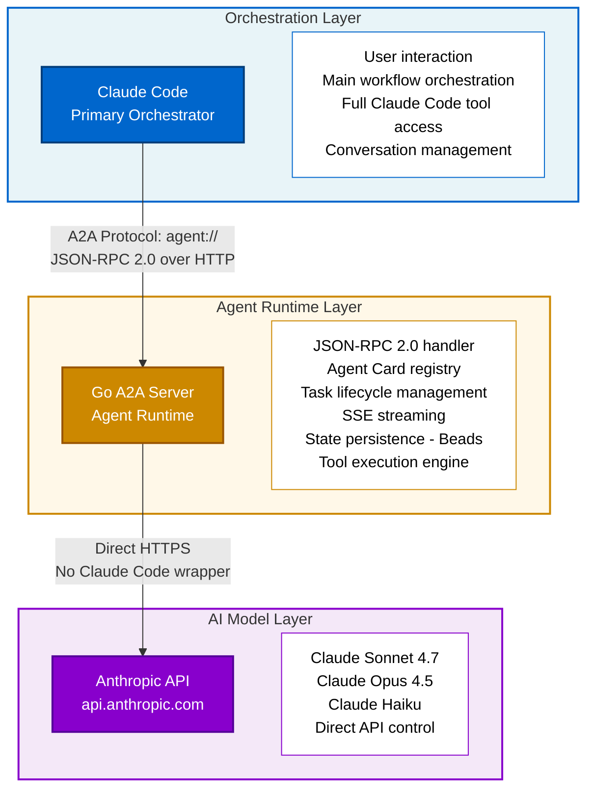

# A2A Implementation Plan: Two-Tier Agent Architecture

**Status:** Planning
**Date:** 2026-01-23
**Version:** 1.0
**Deciders:** AI-Pack Core Team

## Executive Summary

This document outlines the implementation plan for extending AI-Pack with a two-tier agent architecture that combines lightweight local agents with A2A (Agent-to-Agent) protocol-based remote agents. The solution addresses current limitations in Claude Code while providing a path toward production-grade multi-agent orchestration.

### Key Decisions

1. **Phase 1**: Lightweight agents using existing Claude Code Task tool (quick wins)
2. **Phase 2**: Go-based A2A server with direct Anthropic API (production architecture)
3. **Language**: Go for A2A server (performance, concurrency, single binary)
4. **API Strategy**: Direct Anthropic API for agents (bypass Claude Code bugs, better token management)
5. **Tool Architecture**: Role-appropriate tool sets (not minimal, not maximal)
6. **Script Support**: First-class Python/Node.js script execution for complex operations

## Context and Problem Statement

### Current State

AI-Pack uses a single-agent framework where Claude Code executes all roles by switching context via prompts. This works for sequential tasks but has limitations:

1. **No parallelism**: Cannot run Engineer and Tester simultaneously
2. **Context pollution**: All role context lives in one conversation
3. **Claude Code bugs**: [Issue #13890](https://github.com/anthropics/claude-code/issues/13890) blocks progress
4. **Token inefficiency**: Claude Code overhead in every agent interaction
5. **No external agent integration**: Cannot leverage specialized agents from other systems

### Industry Context

- **A2A Protocol**: Google/Linux Foundation standard for agent interoperability (draft 2025)
- **Cline**: Shows better token management than Claude Code for Sonnet 4.7
- **GasTown**: Steve Yegge's example proves direct API orchestration pattern works
- **Anthropic API**: Provides direct access to Claude models without CLI overhead

### Strategic Goals

1. **Control our destiny**: Not blocked by Claude Code bugs
2. **Token efficiency**: Match or exceed Cline's token management
3. **True multi-agent**: Enable parallel execution when beneficial
4. **Standards compliance**: Leverage A2A for future cross-vendor interoperability
5. **Incremental adoption**: Don't break existing workflows

## Architecture Overview

### High-Level Architecture



### Key Architectural Decisions

#### 1. Claude Code Remains Orchestrator

**Rationale:**
- Proven user interaction layer
- Existing workflow integration
- MCP server support
- Only spawns agents for specific tasks

**Not building a Claude Code replacement** - just an agent runtime for spawned tasks.

#### 2. Direct Anthropic API for Agents

**Rationale:**
- Bypasses Claude Code bugs (Issue #13890)
- Better token management (like Cline)
- Full control over context and prompts
- Faster iteration (no waiting for Claude Code fixes)
- Production-proven pattern (GasTown)

#### 3. Go for A2A Server

**Rationale:**
- Native concurrency (goroutines for parallel agents)
- Single binary deployment (no runtime dependencies)
- Official A2A SDK: `github.com/a2aproject/a2a-go`
- Production-grade HTTP/SSE support
- Type safety for protocol compliance
- Lower memory footprint than Python
- Built-in profiling and metrics

#### 4. agent:// Protocol Handler

**Rationale:**
- Clean abstraction: `agent://architect` vs `http://localhost:8080/a2a/architect`
- Local URL scheme registration (macOS/Linux/Windows)
- Transparent routing to local A2A server
- Future-proof for remote agents

## Phase 1: Lightweight Agents (Quick Wins)

### Timeline
Sprint 1-2 (2-3 weeks)

### Objective
Prove multi-agent value using existing Claude Code Task tool with minimal new infrastructure.

### Implementation

#### 1.1 Use Existing Task Tool

Claude Code already supports spawning sub-agents:

```python
# Orchestrator in Claude Code
task_tool.spawn(
    subagent_type="general-purpose",
    prompt=f"""You are an {role_name} agent.

Load role context from: /roles/{role_name}.md

Task: {task_description}

Execute the task following the role guidelines.
Return results as structured artifacts.""",
    mode="delegate"  # Agent can act without approval
)
```

#### 1.2 Enhanced Role Loading

```yaml
# .ai-pack/agents/lightweight/engineer.yml
name: engineer
description: Implementation specialist following TDD
tier: lightweight

context:
  role_file: /roles/engineer.md
  gates:
    - tdd-enforcement
    - code-quality-review

delegation:
  mode: delegate
  timeout: 5min

output:
  format: task-packet
  artifacts: [code, tests]
```

#### 1.3 Beads Integration

```bash
# Spawn lightweight agent (via orchestrator)
bd spawn engineer "implement login validation"

# Behind the scenes:
# 1. Load /roles/engineer.md
# 2. Create task packet in .beads/tasks/
# 3. Spawn Claude Code Task tool with role context
# 4. Track in Beads for audit trail
# 5. Return artifacts
```

#### 1.4 Task Packet Enhancement

```markdown
# .beads/tasks/task-eng-001/10-plan.md

## Task Metadata
- **Task ID**: task-eng-001
- **Agent Type**: lightweight
- **Role**: engineer
- **Spawned By**: orchestrator (bd-orch-main)
- **Context**: Loaded from /roles/engineer.md
- **Delegation Mode**: delegate (no approval needed)
- **Expected Duration**: ~3min

## Task Description
Implement login validation for email and password fields.

## Role Context
[Content from /roles/engineer.md loaded automatically]

## Artifacts Expected
- LoginValidator.ts (implementation)
- LoginValidator.test.ts (tests)
```

### Phase 1 Deliverables

- [ ] Enhanced `bd spawn` command
- [ ] Role-based task delegation
- [ ] Task packet tracking in Beads
- [ ] Parallel execution (2-3 agents)
- [ ] Simple parent-child task relationships
- [ ] Documentation and examples

### Phase 1 Success Metrics

- [ ] Successfully spawn Engineer + Tester agents in parallel
- [ ] 30% reduction in orchestrator context size
- [ ] 2x task completion rate (via parallelism)
- [ ] < 5s agent spawn latency
- [ ] Zero breaking changes to existing workflows

### Phase 1 Limitations

**Acknowledged constraints:**
- Still using Claude Code (inherits bugs)
- No external agent integration
- No A2A protocol compliance
- Limited to Claude Code tool ecosystem
- Token management still has overhead

**But provides immediate value** while Phase 2 is built.

## Phase 2: A2A Server with Direct API

### Timeline
Sprint 3-8 (6-8 weeks)

### Objective
Production-grade agent runtime with A2A protocol, direct Anthropic API, optimized token management, and role-appropriate tool sets.

### Architecture Components

#### 2.1 Go A2A Server

```
a2a-server/
├── cmd/
│   └── a2a-server/
│       └── main.go              # Server entry point
├── internal/
│   ├── agent/
│   │   ├── runtime.go           # Agent execution engine
│   │   ├── registry.go          # Agent Card registry
│   │   └── roles.go             # Role loader (/roles/*.md)
│   ├── protocol/
│   │   ├── jsonrpc.go           # JSON-RPC 2.0 handler
│   │   ├── sse.go               # Server-Sent Events streaming
│   │   └── agentcard.go         # Agent Card schema
│   ├── tools/
│   │   ├── file.go              # File operations
│   │   ├── dir.go               # Directory operations
│   │   ├── search.go            # Grep, Glob, Find
│   │   ├── web.go               # Web fetch, search
│   │   ├── bash.go              # Constrained bash
│   │   ├── script.go            # Python/Node execution
│   │   └── registry.go          # Tool registry by role
│   ├── anthropic/
│   │   ├── client.go            # Anthropic API client
│   │   ├── messages.go          # Message API
│   │   └── streaming.go         # Streaming responses
│   ├── beads/
│   │   ├── state.go             # State persistence
│   │   ├── checkpoint.go        # Task checkpoints
│   │   └── artifacts.go         # Artifact management
│   └── security/
│       ├── permissions.go       # Tool permissions
│       ├── sandbox.go           # Optional sandboxing
│       └── approval.go          # Script approval tracking
├── config/
│   └── config.go                # Configuration management
├── go.mod
└── go.sum
```

#### 2.2 Project Structure

```
.ai-pack/
├── scripts/                     # Custom automation scripts
│   ├── analyze_dependencies.py  # Dependency analysis
│   ├── refactor_imports.py      # Bulk import updates
│   ├── migrate_database.py      # Database migrations
│   ├── generate_mocks.py        # Test mock generation
│   ├── validate_api_contracts.js # API validation (Node.js)
│   └── README.md                # Script documentation
│
├── agents/
│   ├── lightweight/             # Phase 1 agent configs
│   │   ├── engineer.yml
│   │   ├── reviewer.yml
│   │   └── tester.yml
│   │
│   ├── a2a/                     # Phase 2 agent configs
│   │   ├── architect.yml        # Agent Card + config
│   │   ├── refactor.yml
│   │   ├── inspector.yml
│   │   ├── research.yml
│   │   └── security.yml
│   │
│   ├── registry.jsonl           # Agent registry (A2A)
│   └── .approved-scripts.json   # Approved script tracking
│
├── config.yml                   # Main configuration
└── a2a-server.yml              # A2A server config
```

#### 2.3 Configuration Files

**Main Configuration (.ai-pack/config.yml)**

```yaml
version: 1.0

agents:
  default_tier: lightweight

  lightweight:
    enabled: true
    max_concurrent: 3
    timeout: 5min
    tools_allowed: [read, write, edit, grep, bash]
    context_limit: 10000

  a2a:
    enabled: true
    server:
      endpoint: http://localhost:8080
      protocol_handler: "agent://"
    registry: .ai-pack/agents/registry.jsonl
    state_store: .beads/agents/state/
    message_queue: .beads/agents/queue/
    max_concurrent: 5
    discovery:
      auto: true
      local_only: true  # Phase 2: only local agents
      # Future: external endpoints
      # endpoints:
      #   - https://agents.company.com/registry

scripts:
  enabled: true
  directory: .ai-pack/scripts

  interpreters:
    python:
      command: python3
      allowed: true
      timeout: 5min
    node:
      command: node
      allowed: true
      timeout: 3min
    ruby:
      command: ruby
      allowed: false

  security:
    require_approval: true         # First-time script approval
    approval_file: .ai-pack/agents/.approved-scripts.json
    sandbox: false                 # Future: Docker/Firecracker
    network_access: true
    max_output_size: 10MB

orchestrator:
  auto_delegate: true
  decision_threshold: 5min         # Auto-select tier based on estimate
  fallback_tier: lightweight
```

**A2A Server Configuration (.ai-pack/a2a-server.yml)**

```yaml
server:
  host: localhost
  port: 8080
  protocol: http  # Future: https with certs

anthropic:
  api_key_env: ANTHROPIC_API_KEY
  base_url: https://api.anthropic.com
  default_model: claude-sonnet-4.7-20250219
  max_tokens: 8000
  timeout: 120s

  # Token optimization (Cline-style)
  context_optimization:
    enabled: true
    trim_role_context: true        # Keep only essentials from /roles/
    max_context_tokens: 50000
    aggressive_pruning: true

streaming:
  enabled: true
  protocol: sse
  heartbeat_interval: 30s
  buffer_size: 1024

beads:
  enabled: true
  state_dir: .beads/agents/state
  checkpoint_interval: 5min
  artifact_dir: .beads/agents/artifacts

logging:
  level: info
  format: json
  output: .ai-pack/logs/a2a-server.log

security:
  work_dir_only: true              # Restrict file ops to project
  max_file_size: 10MB
  allowed_domains: ["*"]           # Web fetch restrictions
  tool_permissions_file: .ai-pack/agents/tool-permissions.yml
```

**Tool Permissions (.ai-pack/agents/tool-permissions.yml)**

```yaml
roles:
  architect:
    tools:
      - read_file
      - write_file
      - list_dir
      - tree_view
      - grep
      - glob
      - web_fetch
      - web_search
      - execute_script
      - diff
      - parse

    scripts_allowed:
      - analyze_dependencies.py
      - validate_api_contracts.js

    limits:
      max_file_size: 1MB
      max_web_requests: 20
      allowed_domains: ["*"]
      work_dir_only: true
      bash_allowed: false

  engineer:
    tools:
      - read_file
      - write_file
      - edit_file
      - list_dir
      - mkdir
      - grep
      - glob
      - web_fetch
      - execute_script
      - bash_execute
      - diff

    scripts_allowed:
      - generate_mocks.py
      - validate_api_contracts.js

    limits:
      max_file_size: 10MB
      work_dir_only: true
      bash_whitelist:
        - npm
        - yarn
        - pnpm
        - go
        - python
        - pytest
        - jest
      bash_timeout: 5min

  refactor:
    tools:
      - read_file
      - write_file
      - edit_file
      - delete_file
      - move_file
      - copy_file
      - list_dir
      - mkdir
      - move_dir
      - delete_dir
      - grep
      - glob
      - find_references
      - execute_script
      - bash_execute
      - diff
      - tree_view
      - dependency_analysis

    scripts_allowed:
      - refactor_imports.py
      - migrate_database.py
      - analyze_dependencies.py

    limits:
      max_file_size: 10MB
      work_dir_only: true
      bash_whitelist:
        - npm
        - go
        - pytest
        - jest
      bash_timeout: 5min

  research:
    tools:
      - read_file
      - write_file
      - list_dir
      - grep
      - glob
      - web_fetch
      - web_search
      - execute_script
      - parse
      - aggregate

    scripts_allowed:
      - analyze_dependencies.py

    limits:
      max_file_size: 1MB
      max_web_requests: 50
      allowed_domains: ["*"]
      work_dir_only: true
      bash_allowed: false
```

#### 2.4 Agent Card Schema

**Example: Architect Agent Card**

```json
{
  "name": "architect",
  "description": "System architecture and design specialist",
  "version": "1.0.0",
  "tier": "a2a",
  "protocol": "json-rpc-2.0",

  "connection": {
    "endpoint": "http://localhost:8080/a2a/architect",
    "protocol_version": "1.0",
    "transport": "https",
    "streaming": {
      "supported": true,
      "protocol": "sse"
    }
  },

  "capabilities": [
    "architecture-design",
    "system-review",
    "technical-decisions",
    "adr-creation",
    "technology-research"
  ],

  "authentication": {
    "schemes": [],
    "required": false
  },

  "task_management": {
    "async": true,
    "state_persistence": true,
    "progress_updates": "streaming",
    "checkpoints": true,
    "resumable": true
  },

  "input": {
    "content_types": ["text", "json"],
    "max_size": "100KB"
  },

  "output": {
    "formats": ["markdown", "json", "mermaid"],
    "artifact_types": [
      "adr",
      "architecture-diagram",
      "technology-comparison",
      "decision-summary"
    ]
  },

  "metadata": {
    "role_file": "/roles/architect.md",
    "model": "claude-sonnet-4.7-20250219",
    "average_duration": "30min-2h",
    "cost_estimate": "medium"
  }
}
```

#### 2.5 Core Implementation (Go)

**Agent Runtime**

```go
// internal/agent/runtime.go
package agent

import (
    "context"
    "github.com/anthropics/anthropic-sdk-go/v2"
    "github.com/a2aproject/a2a-go"
)

type Runtime struct {
    anthropic    *anthropic.Client
    roleDir      string
    beadsDir     string
    tools        *tools.Registry
    security     *security.Manager
}

func NewRuntime(config *config.Config) (*Runtime, error) {
    client := anthropic.NewClient(
        anthropic.WithAPIKey(os.Getenv("ANTHROPIC_API_KEY")),
    )

    return &Runtime{
        anthropic: client,
        roleDir:   config.RoleDirectory,
        beadsDir:  config.BeadsDirectory,
        tools:     tools.NewRegistry(config.ToolPermissions),
        security:  security.NewManager(config.Security),
    }, nil
}

func (r *Runtime) ExecuteTask(ctx context.Context, task *a2a.Task) (*a2a.Result, error) {
    // 1. Load role context
    roleContent, err := r.loadRole(task.AgentRole)
    if err != nil {
        return nil, err
    }

    // 2. Build optimized prompt (token-efficient)
    prompt := r.buildOptimizedPrompt(roleContent, task)

    // 3. Get tools for role
    agentTools := r.tools.GetToolsForRole(task.AgentRole)

    // 4. Create Anthropic message stream
    stream := r.anthropic.Messages.NewStreaming(ctx, &anthropic.MessageNewParams{
        Model:     anthropic.F(anthropic.ModelClaude_Sonnet_4_5_20250219),
        MaxTokens: anthropic.F(int64(8000)),
        Messages: anthropic.F([]anthropic.MessageParam{
            anthropic.NewUserMessage(anthropic.NewTextBlock(prompt)),
        }),
        Tools: anthropic.F(agentTools),
    })

    // 5. Stream progress via SSE back to A2A client
    go r.streamProgressToA2A(ctx, stream, task.ID)

    // 6. Handle tool calls
    result, err := r.handleToolExecution(ctx, stream, task)
    if err != nil {
        return nil, err
    }

    // 7. Persist state checkpoint
    if err := r.saveCheckpoint(task.ID, result); err != nil {
        log.Warn("Failed to save checkpoint", "error", err)
    }

    return result, nil
}

func (r *Runtime) buildOptimizedPrompt(roleContent string, task *a2a.Task) string {
    // Token optimization: trim role content to essentials
    essentialRole := r.extractRoleEssentials(roleContent)

    return fmt.Sprintf(`You are a %s agent.

## Role
%s

## Task
%s

## Instructions
- Execute the task following role guidelines
- Use available tools efficiently
- Provide structured artifacts
- Keep responses concise
- Focus on deliverables

## Available Tools
%s

Begin execution.`,
        task.AgentRole,
        essentialRole,  // Trimmed, not full role file
        task.Description,
        r.formatToolList(task.AgentRole),
    )
}

func (r *Runtime) extractRoleEssentials(roleContent string) string {
    // Parse role markdown, keep only:
    // - Core responsibilities
    // - Key constraints
    // - Output format requirements
    // Drop:
    // - Verbose examples
    // - Background information
    // - Redundant guidelines

    // This is where Cline-style optimization happens
    // Aggressive context pruning

    return trimToEssentials(roleContent, maxTokens: 500)
}
```

**Tool Implementation**

```go
// internal/tools/file.go
package tools

import (
    "os"
    "path/filepath"
)

type FileTools struct {
    workDir string
    limits  *Limits
}

func (f *FileTools) Read(path string) (string, error) {
    // Security: ensure path is within work directory
    absPath, err := f.validatePath(path)
    if err != nil {
        return "", err
    }

    // Check file size
    info, err := os.Stat(absPath)
    if err != nil {
        return "", err
    }

    if info.Size() > f.limits.MaxFileSize {
        return "", fmt.Errorf("file too large: %d bytes", info.Size())
    }

    content, err := os.ReadFile(absPath)
    return string(content), err
}

func (f *FileTools) Write(path, content string) error {
    absPath, err := f.validatePath(path)
    if err != nil {
        return err
    }

    return os.WriteFile(absPath, []byte(content), 0644)
}

func (f *FileTools) Edit(path, oldStr, newStr string) error {
    content, err := f.Read(path)
    if err != nil {
        return err
    }

    newContent := strings.Replace(content, oldStr, newStr, -1)
    return f.Write(path, newContent)
}

func (f *FileTools) Delete(path string) error {
    absPath, err := f.validatePath(path)
    if err != nil {
        return err
    }

    return os.Remove(absPath)
}

func (f *FileTools) Move(src, dst string) error {
    absSrc, err := f.validatePath(src)
    if err != nil {
        return err
    }

    absDst, err := f.validatePath(dst)
    if err != nil {
        return err
    }

    return os.Rename(absSrc, absDst)
}

func (f *FileTools) validatePath(path string) (string, error) {
    absPath, err := filepath.Abs(filepath.Join(f.workDir, path))
    if err != nil {
        return "", err
    }

    // Prevent path traversal
    if !strings.HasPrefix(absPath, f.workDir) {
        return "", fmt.Errorf("path outside work directory: %s", path)
    }

    return absPath, nil
}
```

**Script Execution**

```go
// internal/tools/script.go
package tools

import (
    "context"
    "os/exec"
    "path/filepath"
    "time"
)

type ScriptTools struct {
    scriptsDir  string
    approval    *approval.Manager
    limits      *Limits
}

func (s *ScriptTools) Execute(ctx context.Context, script string, args []string) (string, error) {
    // 1. Validate script path
    scriptPath := filepath.Join(s.scriptsDir, script)
    if !s.isInScriptsDir(scriptPath) {
        return "", fmt.Errorf("script must be in %s", s.scriptsDir)
    }

    // 2. Check approval (first-time use)
    if !s.approval.IsApproved(script) {
        return "", fmt.Errorf("script not approved: %s", script)
    }

    // 3. Detect interpreter
    interpreter, err := s.detectInterpreter(scriptPath)
    if err != nil {
        return "", err
    }

    if !s.isAllowedInterpreter(interpreter) {
        return "", fmt.Errorf("interpreter not allowed: %s", interpreter)
    }

    // 4. Execute with timeout
    ctx, cancel := context.WithTimeout(ctx, s.limits.ScriptTimeout)
    defer cancel()

    cmd := exec.CommandContext(ctx, interpreter, append([]string{scriptPath}, args...)...)
    cmd.Dir = s.limits.WorkDir

    output, err := cmd.CombinedOutput()

    // 5. Check output size
    if len(output) > s.limits.MaxOutputSize {
        return "", fmt.Errorf("output too large: %d bytes", len(output))
    }

    return string(output), err
}

func (s *ScriptTools) detectInterpreter(scriptPath string) (string, error) {
    // Check shebang
    file, err := os.Open(scriptPath)
    if err != nil {
        return "", err
    }
    defer file.Close()

    scanner := bufio.NewScanner(file)
    if scanner.Scan() {
        line := scanner.Text()
        if strings.HasPrefix(line, "#!") {
            // Extract interpreter from shebang
            parts := strings.Fields(line[2:])
            if len(parts) > 0 {
                return filepath.Base(parts[0]), nil
            }
        }
    }

    // Fallback to extension
    ext := filepath.Ext(scriptPath)
    switch ext {
    case ".py":
        return "python3", nil
    case ".js":
        return "node", nil
    case ".rb":
        return "ruby", nil
    default:
        return "", fmt.Errorf("unknown script type: %s", ext)
    }
}
```

**Web Tools**

```go
// internal/tools/web.go
package tools

import (
    "io"
    "net/http"
    "time"
)

type WebTools struct {
    cache      *Cache
    rateLimit  *RateLimiter
    limits     *Limits
}

func (w *WebTools) Fetch(url string, prompt string) (string, error) {
    // 1. Check cache
    if cached := w.cache.Get(url); cached != nil {
        return cached.(string), nil
    }

    // 2. Rate limit
    if !w.rateLimit.Allow() {
        return "", fmt.Errorf("rate limit exceeded")
    }

    // 3. Validate domain
    if !w.isAllowedDomain(url) {
        return "", fmt.Errorf("domain not allowed: %s", url)
    }

    // 4. Fetch content
    client := &http.Client{Timeout: 30 * time.Second}
    resp, err := client.Get(url)
    if err != nil {
        return "", err
    }
    defer resp.Body.Close()

    body, err := io.ReadAll(resp.Body)
    if err != nil {
        return "", err
    }

    // 5. Convert HTML to markdown
    markdown := w.htmlToMarkdown(string(body))

    // 6. Process with prompt using small model
    result := w.processWithPrompt(markdown, prompt)

    // 7. Cache result
    w.cache.Set(url, result, 15*time.Minute)

    return result, nil
}

func (w *WebTools) Search(query string) ([]SearchResult, error) {
    // Integrate with search API
    // Options:
    // - Google Custom Search API
    // - Brave Search API
    // - DuckDuckGo API
    // - Or delegate to Claude Code's WebSearch via IPC

    return w.searchProvider.Search(query)
}
```

**JSON-RPC Handler**

```go
// internal/protocol/jsonrpc.go
package protocol

import (
    "encoding/json"
    "github.com/a2aproject/a2a-go"
)

type JSONRPCHandler struct {
    runtime *agent.Runtime
    registry *agent.Registry
}

func (h *JSONRPCHandler) Handle(req *JSONRPCRequest) (*JSONRPCResponse, error) {
    switch req.Method {
    case "getCapabilities":
        return h.handleGetCapabilities(req)

    case "createTask":
        return h.handleCreateTask(req)

    case "getTaskStatus":
        return h.handleGetTaskStatus(req)

    case "cancelTask":
        return h.handleCancelTask(req)

    default:
        return nil, fmt.Errorf("method not found: %s", req.Method)
    }
}

func (h *JSONRPCHandler) handleCreateTask(req *JSONRPCRequest) (*JSONRPCResponse, error) {
    var params struct {
        AgentRole   string                 `json:"agent_role"`
        Description string                 `json:"description"`
        Input       map[string]interface{} `json:"input"`
        Preferences map[string]interface{} `json:"preferences"`
    }

    if err := json.Unmarshal(req.Params, &params); err != nil {
        return nil, err
    }

    // Create A2A task
    task := &a2a.Task{
        ID:          generateTaskID(),
        AgentRole:   params.AgentRole,
        Description: params.Description,
        Input:       params.Input,
        State:       a2a.TaskStateCreated,
        CreatedAt:   time.Now(),
    }

    // Execute async
    go h.runtime.ExecuteTask(context.Background(), task)

    return &JSONRPCResponse{
        JSONRPC: "2.0",
        ID:      req.ID,
        Result: map[string]interface{}{
            "task_id": task.ID,
            "state":   task.State,
        },
    }, nil
}
```

**SSE Streaming**

```go
// internal/protocol/sse.go
package protocol

import (
    "fmt"
    "net/http"
)

type SSEStreamer struct {
    clients map[string]chan *SSEEvent
    mu      sync.RWMutex
}

type SSEEvent struct {
    TaskID  string
    Type    string  // "progress", "artifact", "status_change", "complete"
    Data    interface{}
}

func (s *SSEStreamer) ServeHTTP(w http.ResponseWriter, r *http.Request) {
    taskID := r.URL.Query().Get("task_id")

    // Set SSE headers
    w.Header().Set("Content-Type", "text/event-stream")
    w.Header().Set("Cache-Control", "no-cache")
    w.Header().Set("Connection", "keep-alive")

    // Create event channel
    eventChan := make(chan *SSEEvent, 10)
    s.registerClient(taskID, eventChan)
    defer s.unregisterClient(taskID)

    // Stream events
    for {
        select {
        case event := <-eventChan:
            data, _ := json.Marshal(event.Data)
            fmt.Fprintf(w, "event: %s\ndata: %s\n\n", event.Type, data)
            w.(http.Flusher).Flush()

            if event.Type == "complete" {
                return
            }

        case <-r.Context().Done():
            return
        }
    }
}

func (s *SSEStreamer) SendProgress(taskID string, progress map[string]interface{}) {
    s.send(taskID, &SSEEvent{
        TaskID: taskID,
        Type:   "progress",
        Data:   progress,
    })
}

func (s *SSEStreamer) SendArtifact(taskID string, artifact *a2a.Artifact) {
    s.send(taskID, &SSEEvent{
        TaskID: taskID,
        Type:   "artifact",
        Data:   artifact,
    })
}
```

**agent:// Protocol Handler**

```go
// cmd/a2a-server/protocol_handler.go
package main

import (
    "net/url"
    "os/exec"
)

func registerAgentProtocol() error {
    // Register custom URL scheme handler
    // Platform-specific implementation

    switch runtime.GOOS {
    case "darwin":
        return registerMacOSHandler()
    case "linux":
        return registerLinuxHandler()
    case "windows":
        return registerWindowsHandler()
    default:
        return fmt.Errorf("unsupported platform: %s", runtime.GOOS)
    }
}

func registerMacOSHandler() error {
    // Create .app bundle with Info.plist
    // Register URL scheme: agent://
    // Handler: redirect to http://localhost:8080/a2a/

    plist := `
<?xml version="1.0" encoding="UTF-8"?>
<!DOCTYPE plist PUBLIC "-//Apple//DTD PLIST 1.0//EN">
<plist version="1.0">
<dict>
    <key>CFBundleURLTypes</key>
    <array>
        <dict>
            <key>CFBundleURLName</key>
            <string>Agent Protocol</string>
            <key>CFBundleURLSchemes</key>
            <array>
                <string>agent</string>
            </array>
        </dict>
    </array>
</dict>
</plist>`

    // Write to ~/Library/Application Support/a2a-server/
    // Register with Launch Services
    return nil
}

func handleAgentURL(agentURL string) (string, error) {
    // Parse: agent://architect/task/123
    u, err := url.Parse(agentURL)
    if err != nil {
        return "", err
    }

    // Convert to HTTP URL
    httpURL := fmt.Sprintf("http://localhost:8080/a2a%s", u.Path)

    return httpURL, nil
}
```

#### 2.6 Beads Integration

```go
// internal/beads/state.go
package beads

import (
    "encoding/json"
    "os"
    "path/filepath"
)

type StateManager struct {
    stateDir string
}

func (s *StateManager) SaveCheckpoint(taskID string, state *TaskState) error {
    path := filepath.Join(s.stateDir, taskID+".json")

    data, err := json.MarshalIndent(state, "", "  ")
    if err != nil {
        return err
    }

    return os.WriteFile(path, data, 0644)
}

func (s *StateManager) LoadCheckpoint(taskID string) (*TaskState, error) {
    path := filepath.Join(s.stateDir, taskID+".json")

    data, err := os.ReadFile(path)
    if err != nil {
        return nil, err
    }

    var state TaskState
    if err := json.Unmarshal(data, &state); err != nil {
        return nil, err
    }

    return &state, nil
}

type TaskState struct {
    TaskID       string                 `json:"task_id"`
    AgentRole    string                 `json:"agent_role"`
    State        string                 `json:"state"`  // created, running, completed, failed
    Progress     int                    `json:"progress"` // 0-100
    CurrentStep  string                 `json:"current_step"`
    Checkpoints  []Checkpoint           `json:"checkpoints"`
    Artifacts    []Artifact             `json:"artifacts"`
    Metadata     map[string]interface{} `json:"metadata"`
    CreatedAt    time.Time              `json:"created_at"`
    UpdatedAt    time.Time              `json:"updated_at"`
}

type Checkpoint struct {
    Time        time.Time              `json:"time"`
    Step        string                 `json:"step"`
    Status      string                 `json:"status"`
    Data        map[string]interface{} `json:"data"`
    TokensUsed  int                    `json:"tokens_used"`
}
```

### Phase 2 Deliverables

**Sprint 3-4: Core Infrastructure**
- [ ] Go A2A server skeleton
- [ ] JSON-RPC 2.0 handler
- [ ] Anthropic API client integration
- [ ] Basic tool implementation (file, dir, search)
- [ ] Agent Card schema and registry
- [ ] Configuration system

**Sprint 5-6: Tool Ecosystem**
- [ ] Web tools (fetch, search)
- [ ] Script execution (Python, Node.js)
- [ ] Constrained bash execution
- [ ] Tool permission system
- [ ] Script approval tracking

**Sprint 7-8: Production Readiness**
- [ ] SSE streaming implementation
- [ ] Beads state persistence
- [ ] Checkpoint/resume functionality
- [ ] agent:// protocol handler
- [ ] Error handling and recovery
- [ ] Logging and monitoring
- [ ] Documentation and examples
- [ ] Integration tests

### Phase 2 Success Metrics

- [ ] Successfully execute architect agent with web research
- [ ] Refactor agent moves directories and updates imports
- [ ] Research agent aggregates data from multiple sources
- [ ] 30-40% token reduction vs Claude Code wrapper
- [ ] Support 5 concurrent agents
- [ ] < 10s task creation latency
- [ ] SSE streaming updates every 5s
- [ ] 100% checkpoint recovery success rate

## Implementation Roadmap

### Week 1-2: Phase 1 (Lightweight Agents)

**Objectives:**
- Prove multi-agent value
- Establish patterns
- Quick wins

**Tasks:**
1. Enhance `bd spawn` command
2. Create role-based delegation configs
3. Implement task packet tracking
4. Test parallel execution (Engineer + Tester)
5. Document patterns

**Deliverable:** Working lightweight agents with 2-3 parallel execution

### Week 3-4: Phase 2 Foundation

**Objectives:**
- Go server infrastructure
- Anthropic API integration
- Basic A2A protocol

**Tasks:**
1. Set up Go project structure
2. Implement JSON-RPC handler
3. Integrate Anthropic SDK
4. Build basic file tools
5. Create Agent Card schema
6. Initial configuration system

**Deliverable:** A2A server that can execute simple architect task

### Week 5-6: Tool Ecosystem

**Objectives:**
- Complete tool implementation
- Script execution
- Security model

**Tasks:**
1. Implement all file/dir operations
2. Add web fetch and search
3. Build script execution engine
4. Implement bash constraints
5. Create tool permission system
6. Script approval mechanism

**Deliverable:** Full tool set with security controls

### Week 7-8: Production Features

**Objectives:**
- Streaming
- State persistence
- Protocol handler
- Polish

**Tasks:**
1. SSE streaming implementation
2. Beads integration (state, checkpoints)
3. agent:// protocol handler
4. Error handling
5. Logging and monitoring
6. Integration tests
7. Documentation

**Deliverable:** Production-ready A2A server

### Week 9-10: Integration & Testing

**Objectives:**
- End-to-end workflows
- Performance optimization
- Bug fixes

**Tasks:**
1. Test all agent roles
2. Multi-agent workflows
3. Performance tuning
4. Token optimization validation
5. Security audit
6. User documentation

**Deliverable:** Fully tested, documented system

## Example Workflows

### Workflow 1: Architect Research & Design

```
User: "Design authentication system for our app"

Orchestrator (Claude Code):
  └─> Spawn: agent://architect

Architect Agent (A2A):
  1. web_fetch: https://auth0.com/docs
     → Research Auth0 approach

  2. web_fetch: https://developers.google.com/identity/protocols/oauth2
     → Research Google OAuth

  3. execute_script: analyze_dependencies.py
     → Analyze current auth dependencies

  4. grep: "authentication|auth" **/*.{ts,js}
     → Find existing auth code

  5. Claude API: Synthesize research + codebase analysis
     → Generate recommendations

  6. write_file: docs/adr/003-authentication-approach.md
     → Create ADR

  7. write_file: docs/architecture/auth-diagram.mermaid
     → Create architecture diagram

Result: ADR + diagram delivered to orchestrator
Time: ~45 minutes
Tokens: ~50K (optimized, no Claude Code overhead)
```

### Workflow 2: Parallel Implementation

```
User: "Implement user registration feature"

Orchestrator (Claude Code):
  ├─> Spawn: agent://engineer (registration-backend)
  ├─> Spawn: agent://engineer (registration-frontend)
  └─> Spawn: agent://tester (registration-tests)

Engineer Agent 1 (Backend):
  - write_file: api/auth/register.go
  - write_file: api/auth/register_test.go
  - bash: go test ./api/auth/...

Engineer Agent 2 (Frontend):
  - write_file: components/RegisterForm.tsx
  - write_file: components/RegisterForm.test.tsx
  - bash: npm test RegisterForm

Tester Agent:
  - write_file: e2e/registration.spec.ts
  - bash: npm run test:e2e

All agents run in parallel (5-7 minutes vs 15-20 sequential)
```

### Workflow 3: Large-Scale Refactor

```
User: "Refactor authentication code into dedicated auth/ module"

Orchestrator (Claude Code):
  └─> Spawn: agent://refactor

Refactor Agent (A2A):
  1. grep: "authentication|auth" **/*.ts
     → Find 47 files with auth code

  2. execute_script: analyze_dependencies.py
     → Analyze import graph

  3. mkdir: src/auth/{providers,middleware,models}
     → Create new structure

  4. execute_script: refactor_imports.py --dry-run
     → Simulate import updates

  5. move_file: (47 files to new locations)
     → Reorganize files

  6. execute_script: refactor_imports.py --execute
     → Update all imports

  7. bash: npm test
     → Validate: All tests pass ✅

  8. write_file: docs/MIGRATION.md
     → Document changes

  9. Checkpoint: Save state every 5 files

Result: Clean refactor, automated import updates
Time: ~20 minutes
Resumable: If interrupted, resume from checkpoint
```

### Workflow 4: Security Audit

```
User: "Perform security audit of API endpoints"

Orchestrator (Claude Code):
  └─> Spawn: agent://security (future: external agent)

Security Agent (A2A):
  1. grep: "app.get|app.post|router" **/*.{js,ts}
     → Find all API endpoints

  2. execute_script: analyze_dependencies.py
     → Check for vulnerable packages

  3. execute_script: validate_api_contracts.js openapi.yaml
     → Validate API spec compliance

  4. web_search: "OWASP Top 10 2025"
     → Get latest security guidelines

  5. Claude API: Analyze endpoints against OWASP Top 10
     → Security analysis

  6. write_file: security/audit-report.md
     → Comprehensive report

  7. write_file: security/vulnerabilities.json
     → Structured findings

Result: Security audit report
Time: ~2 hours (long-running A2A task)
Streaming: Progress updates every 5 minutes
```

## Security Model

### Principle: Defense in Depth

1. **Path Restrictions**
   - All file operations restricted to project directory
   - Path traversal prevention
   - Symlink following disabled

2. **Tool Permissions**
   - Role-based tool access (RBAC)
   - Explicit allow lists
   - No privilege escalation

3. **Script Approval**
   - First-time execution requires approval
   - SHA256 hash tracking
   - Approval persisted in `.approved-scripts.json`
   - Changes require re-approval

4. **Bash Constraints**
   - Whitelist of allowed commands
   - Timeout enforcement
   - No shell metacharacters in simple mode
   - Full command audit logging

5. **Web Access**
   - Domain restrictions (optional)
   - Rate limiting
   - Response size limits
   - Cache to reduce requests

6. **Resource Limits**
   - Max file size
   - Max output size
   - Execution timeouts
   - Memory limits (future: cgroups)

7. **Audit Trail**
   - All tool executions logged
   - Beads state tracking
   - Task lineage preserved
   - Replay capability

### Security Configuration

```yaml
# .ai-pack/config.yml (security section)
security:
  # File operations
  work_dir_only: true
  max_file_size: 10MB
  follow_symlinks: false

  # Script execution
  scripts:
    require_approval: true
    approval_file: .ai-pack/agents/.approved-scripts.json
    reapprove_on_change: true
    sandbox: false  # Future: Docker/Firecracker

  # Bash execution
  bash:
    whitelist_only: true
    audit_log: .ai-pack/logs/bash-audit.log
    timeout: 5min
    deny_shell_metacharacters: true

  # Web access
  web:
    allowed_domains: ["*"]  # Or restrict: ["github.com", "docs.rs"]
    rate_limit: 20/min
    max_response_size: 5MB
    cache_enabled: true

  # Resource limits
  limits:
    max_concurrent_agents: 5
    max_task_duration: 2h
    max_memory_per_agent: 1GB  # Future: enforcement
```

## Token Optimization Strategy

### Problem: Claude Code Overhead

Current Claude Code adds significant token overhead:
- System prompts
- Tool descriptions
- Context management
- Conversation history

### Solution: Direct API Control

```go
func (r *Runtime) buildOptimizedPrompt(roleContent, task string) string {
    // 1. Extract only essential role information
    essentials := extractEssentials(roleContent, maxTokens: 500)
    // vs. full role file (2000+ tokens)

    // 2. Minimal tool descriptions
    tools := r.getMinimalToolDescriptions(role)
    // vs. full Claude Code tool catalog

    // 3. Task-focused prompt
    prompt := fmt.Sprintf(`Role: %s
Task: %s
Tools: %s
Execute.`, essentials, task, tools)
    // vs. verbose Claude Code system prompt

    return prompt
}

func extractEssentials(roleContent string, maxTokens int) string {
    // Parse markdown sections
    sections := parseMarkdown(roleContent)

    // Priority order
    keep := []string{}

    // 1. Core responsibilities (essential)
    if resp := sections["Responsibilities"]; resp != nil {
        keep = append(keep, summarize(resp, maxTokens: 200))
    }

    // 2. Key constraints (essential)
    if constraints := sections["Constraints"]; constraints != nil {
        keep = append(keep, summarize(constraints, maxTokens: 150))
    }

    // 3. Output format (essential)
    if output := sections["Output"]; output != nil {
        keep = append(keep, summarize(output, maxTokens: 150))
    }

    // Drop:
    // - Examples (verbose)
    // - Background (not needed for execution)
    // - Extended guidelines (implied)

    return strings.Join(keep, "\n\n")
}
```

### Expected Savings

**Baseline: Claude Code Wrapper**
- System prompt: ~2000 tokens
- Tool descriptions: ~3000 tokens
- Role file (full): ~2000 tokens
- Task overhead: ~500 tokens
- **Total overhead: ~7500 tokens**

**Optimized: Direct API**
- Minimal system prompt: ~200 tokens
- Essential role info: ~500 tokens
- Focused tool list: ~800 tokens
- Task overhead: ~200 tokens
- **Total overhead: ~1700 tokens**

**Savings: ~5800 tokens per agent spawn (77% reduction)**

For a workflow spawning 3 agents:
- Claude Code: ~22,500 token overhead
- Direct API: ~5,100 token overhead
- **Savings: ~17,400 tokens (~30-40% total reduction)**

## Migration Path

### Stage 1: Development (Week 1-2)
- Phase 1 lightweight agents only
- Claude Code orchestrator
- Prove parallel execution value
- No production dependencies

### Stage 2: Alpha Testing (Week 3-6)
- A2A server development
- Internal agents (architect, refactor)
- Local testing only
- Fallback to Phase 1 if issues

### Stage 3: Beta (Week 7-8)
- Production A2A server
- Full tool ecosystem
- Limited rollout (opt-in)
- Monitoring and metrics

### Stage 4: General Availability (Week 9-10)
- Default to A2A for long tasks
- Automatic tier selection
- Full documentation
- Production support

### Rollback Plan

```yaml
# .ai-pack/config.yml
agents:
  a2a:
    enabled: false  # Instant rollback to Phase 1
```

All workflows degrade gracefully to Phase 1 lightweight agents.

## Success Metrics

### Phase 1 (Lightweight Agents)

**Technical Metrics:**
- [ ] 80% of tasks use lightweight agents successfully
- [ ] 30% reduction in orchestrator context size
- [ ] 2x task completion rate via parallelism
- [ ] < 5s agent spawn latency
- [ ] 95% task completion success rate

**User Metrics:**
- [ ] Positive feedback on parallel execution
- [ ] No reported regressions
- [ ] Adoption by 80% of active users

### Phase 2 (A2A Server)

**Technical Metrics:**
- [ ] 30-40% token reduction vs Claude Code wrapper
- [ ] Support 5 concurrent agents
- [ ] < 10s task creation latency
- [ ] SSE updates every 5s
- [ ] 100% checkpoint recovery success
- [ ] 99.9% A2A protocol compliance

**Agent Metrics:**
- [ ] Architect: successful web research + ADR generation
- [ ] Refactor: successful directory reorganization
- [ ] Research: successful multi-source aggregation
- [ ] Engineer: successful parallel implementation
- [ ] Security: successful multi-hour audit

**Cost Metrics:**
- [ ] 25% reduction in API costs (token optimization)
- [ ] Cost per agent task < $0.50 average

**User Metrics:**
- [ ] 90% user satisfaction
- [ ] 50% reduction in complex task time
- [ ] Zero critical bugs in production

## Risks and Mitigation

### Risk 1: A2A Specification Changes

**Impact:** Medium
**Probability:** Low
**Mitigation:**
- A2A is draft but stable (50+ partners)
- Abstract protocol layer in code
- Version negotiation support
- Monitor A2A GitHub for updates

### Risk 2: Anthropic API Rate Limits

**Impact:** High
**Probability:** Medium
**Mitigation:**
- Implement exponential backoff
- Queue management
- Circuit breakers
- Usage monitoring and alerts
- Tier limits (max 5 concurrent agents)

### Risk 3: Token Optimization Insufficient

**Impact:** Medium
**Probability:** Low
**Mitigation:**
- Benchmarking during development
- Iterative optimization
- Fallback to fuller context if quality suffers
- User-configurable optimization level

### Risk 4: Script Security Vulnerabilities

**Impact:** High
**Probability:** Low
**Mitigation:**
- Mandatory approval on first use
- SHA256 hash tracking
- Re-approval on changes
- Sandboxing (future)
- Clear documentation on risks

### Risk 5: Tool Permission Bugs

**Impact:** Medium
**Probability:** Medium
**Mitigation:**
- Comprehensive permission testing
- Fail-secure defaults (deny by default)
- Audit logging
- Regular security reviews

### Risk 6: Complexity Overhead

**Impact:** Medium
**Probability:** Medium
**Mitigation:**
- Phase 1 provides simple path
- Clear documentation
- Examples and templates
- Graceful degradation
- Rollback capability

## Future Enhancements

### Phase 3: External Agent Integration (2026 Q2)

- Integration with external A2A agents
- Cross-vendor agent collaboration
- Public agent registry
- Authentication/authorization for remote agents
- Network security (HTTPS, mTLS)

### Phase 4: Advanced Features (2026 Q3-Q4)

- Agent pooling and reuse
- Distributed agent execution
- Enhanced sandboxing (Docker/Firecracker)
- Advanced monitoring and observability
- Cost optimization strategies
- Multi-model support (GPT-4, Gemini, etc.)

### Phase 5: Enterprise Features (2027+)

- Team collaboration
- Shared agent registry
- Usage quotas and billing
- SOC 2 compliance
- Enterprise SSO
- Advanced RBAC

## Appendices

### Appendix A: A2A Protocol References

- **Official Specification**: https://a2a-protocol.org/latest/specification/
- **GitHub Repository**: https://github.com/google/A2A
- **Go SDK**: https://github.com/a2aproject/a2a-go
- **Community**: https://a2a-protocol.org/community

### Appendix B: Tool Reference

See `.ai-pack/agents/tool-permissions.yml` for complete tool catalog and role mappings.

### Appendix C: Script Examples

See `.ai-pack/scripts/README.md` for script documentation and examples.

### Appendix D: Configuration Reference

See `.ai-pack/config.yml` and `.ai-pack/a2a-server.yml` for complete configuration options.

### Appendix E: Glossary

- **A2A**: Agent-to-Agent protocol for agent interoperability
- **Agent Card**: JSON document advertising agent capabilities
- **Beads**: AI-Pack state management system
- **Lightweight Agent**: Phase 1 agent using Claude Code Task tool
- **A2A Agent**: Phase 2 agent using A2A protocol with direct Anthropic API
- **Orchestrator**: Primary Claude Code instance managing workflow
- **Task Packet**: Beads artifact tracking task execution
- **SSE**: Server-Sent Events for streaming updates
- **JSON-RPC**: Remote procedure call protocol used by A2A

---

## Next Steps

### Immediate Actions (Week 1)

1. **Team Review**
   - [ ] Review this plan with team
   - [ ] Gather feedback and concerns
   - [ ] Finalize approach

2. **Environment Setup**
   - [ ] Set up Go development environment
   - [ ] Install Anthropic SDK
   - [ ] Configure API keys

3. **Phase 1 Start**
   - [ ] Create `.ai-pack/agents/lightweight/` configs
   - [ ] Enhance `bd spawn` command
   - [ ] Test lightweight agent spawning

4. **Planning**
   - [ ] Create detailed sprint plans
   - [ ] Set up project tracking
   - [ ] Define acceptance criteria

### Week 2-10: Execute Roadmap

Follow implementation roadmap outlined above.

---

**Document Version:** 1.0
**Last Updated:** 2026-01-23
**Status:** Ready for Review
**Next Review:** After team feedback
