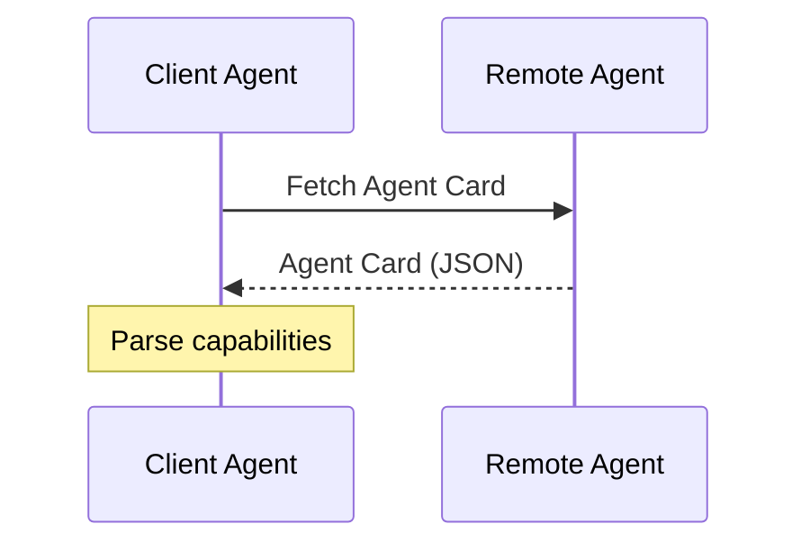
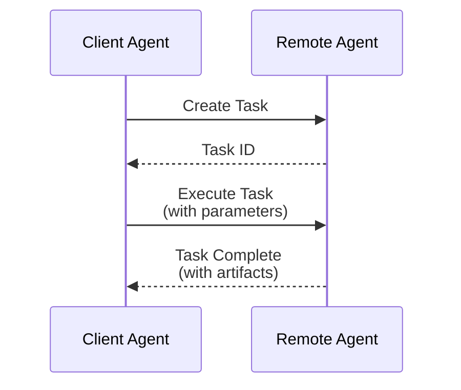
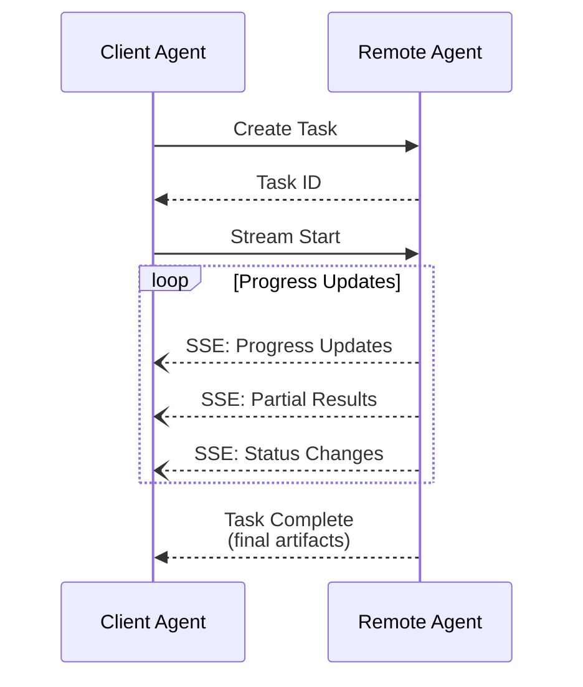
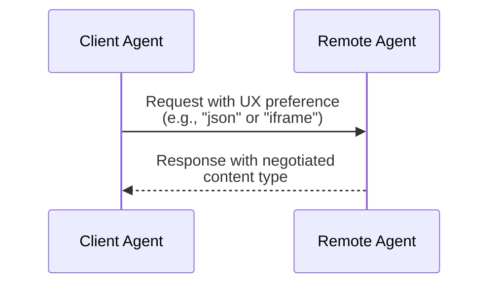
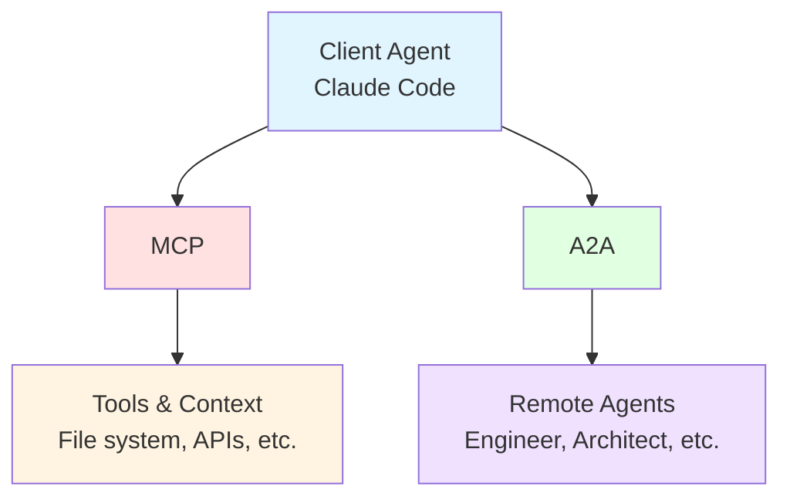

# A2A (Agent-to-Agent) Protocol

**Version:** Draft (2025)
**Organization:** Linux Foundation (contributed by Google)
**License:** Apache 2.0
**Official Site:** https://a2a-protocol.org

## Overview

Agent2Agent (A2A) is an open protocol enabling communication and interoperability between opaque agentic applications. It allows AI agents from different vendors and frameworks to collaborate across enterprise platforms without exposing their internal state, memory, or tools.

## Protocol Announcement

Announced by Google Cloud on April 9, 2025, with support from 50+ technology partners, A2A represents a new era of agent interoperability in enterprise AI systems.

## Core Design Principles

### 1. Agentic Capabilities
Enables agents to collaborate in natural, unstructured modalities without requiring shared memory or tools.

### 2. Existing Standards
Built on proven technologies:
- **Transport:** HTTP/HTTPS
- **Streaming:** Server-Sent Events (SSE)
- **RPC Format:** JSON-RPC 2.0

### 3. Enterprise Security
- Authentication/authorization with parity to OpenAPI schemes
- Secure, authenticated agent-to-agent communication
- Support for air-gapped environments

### 4. Long-Running Tasks
Supports tasks ranging from quick operations to hours or even days, with real-time feedback and status synchronization.

### 5. Modality Agnostic
Supports multiple content types:
- Text
- Audio and video streaming
- Files
- Structured JSON data
- Images and media
- Web forms and iframes

### 6. Opacity Preservation
Agents collaborate without sharing:
- Internal memory
- Proprietary logic
- Tool implementations
- Internal state

## Architecture

### Agent Roles

**Client Agent**
- Formulates tasks
- Communicates requirements
- Consumes results

**Remote Agent**
- Advertises capabilities
- Executes tasks
- Provides information or performs actions

### Communication Modes

**1. Synchronous Request/Response**
- Immediate task execution
- Direct result delivery
- Suitable for quick operations

**2. Streaming (Server-Sent Events)**
- Real-time progress updates
- Long-running task feedback
- Incremental result delivery

**3. Asynchronous Push Notifications**
- Background task execution
- Event-driven updates
- Decoupled agent communication

## Key Components

### Agent Card

JSON format document that advertises agent capabilities:

```json
{
  "name": "Engineer Agent",
  "description": "Implements features following TDD practices",
  "capabilities": [
    "code-implementation",
    "test-driven-development",
    "refactoring"
  ],
  "connection": {
    "endpoint": "https://agent.example.com/a2a",
    "protocol": "json-rpc-2.0"
  },
  "authentication": {
    "schemes": ["bearer", "api-key"]
  }
}
```

**Purpose:**
- Capability discovery
- Connection information
- Authentication requirements
- Metadata about agent functionality

### Task Object

Central unit of work with defined lifecycle:

**Task Lifecycle States:**
1. Created
2. Running
3. Completed / Failed
4. Cancelled (optional)

**Task Properties:**
- Unique identifier
- Current state
- Input parameters
- Output artifacts
- Progress indicators
- Error information (if failed)

### Messages

Communication units between agents containing:

**Message Structure:**
- **Context:** Background information for task
- **Replies:** Responses to previous messages
- **Artifacts:** Output data (files, JSON, media)
- **User Instructions:** Human-provided guidance
- **Parts:** Fully formed content pieces

**Part Structure:**
```json
{
  "type": "text|image|video|json|file",
  "content": "...",
  "contentType": "application/json",
  "metadata": {}
}
```

### Artifacts

Output delivered by agents:
- Files
- Structured data (JSON)
- Media (images, video, audio)
- Text responses
- Code
- Documents

## Protocol Interaction Patterns

### Discovery Flow



### Task Execution Flow (Synchronous)



### Task Execution Flow (Streaming)



### User Experience Negotiation



## JSON-RPC Methods

### Core Methods

**1. Agent Discovery**
```json
{
  "jsonrpc": "2.0",
  "method": "getCapabilities",
  "id": 1
}
```

**2. Task Management**
```json
{
  "jsonrpc": "2.0",
  "method": "createTask",
  "params": {
    "description": "Implement user authentication",
    "input": {},
    "preferences": {
      "outputFormat": "json"
    }
  },
  "id": 2
}
```

**3. Task Status**
```json
{
  "jsonrpc": "2.0",
  "method": "getTaskStatus",
  "params": {
    "taskId": "task-abc-123"
  },
  "id": 3
}
```

**4. Planned: Query Skill**
```json
{
  "jsonrpc": "2.0",
  "method": "querySkill",
  "params": {
    "capability": "code-review"
  },
  "id": 4
}
```

## SDKs and Implementation

### Official SDKs

**Python**
```bash
pip install a2a-sdk
```

**JavaScript/TypeScript**
```bash
npm install @a2a-js/sdk
```

**Go**
```bash
go get github.com/a2aproject/a2a-go
```

**Java (Maven)**
```xml
<dependency>
  <groupId>org.a2a</groupId>
  <artifactId>a2a-sdk</artifactId>
</dependency>
```

**.NET (NuGet)**
```bash
dotnet add package A2A
```

## Complementary Protocols

### Model Context Protocol (MCP)
- Developed by Anthropic
- Provides tools and context to agents
- Works alongside A2A
- MCP handles tool/context provisioning
- A2A handles agent-to-agent communication

**Relationship:**



## Planned Enhancements

### Near-Term
1. **Dynamic UX Negotiation:** Enhanced capability for agents to negotiate UI representations within tasks
2. **QuerySkill Method:** Check if remote agent supports specific capabilities before task creation
3. **Client-Initiated Methods:** Beyond task management (e.g., notification subscriptions)

### Medium-Term
4. **Streaming Reliability:** Improved error handling and reconnection for SSE streams
5. **Enhanced Push Notifications:** More robust asynchronous communication patterns
6. **Formalized Credentials:** Standardized credential exchange in Agent Cards

## Enterprise Features

### Cross-Platform Integration
- Works across different clouds and platforms
- Enables hybrid cloud architectures
- Supports multi-vendor agent ecosystems

### Workflow Automation
- Standardized agent management
- Automated task delegation
- Cross-agent workflow orchestration

### Security & Compliance
- Enterprise-grade authentication
- Authorization controls
- Audit logging support
- Air-gapped deployment support

## Use Cases

### Software Development
- Orchestrator delegates to Engineer, Reviewer, Tester agents
- Each agent maintains specialized context
- Parallel execution of independent tasks

### Research & Analysis
- Client agent requests market analysis from specialized research agent
- Long-running data collection and analysis
- Structured report delivery

### Customer Support
- Support agent delegates to knowledge base agents
- Real-time information retrieval
- Multi-step problem resolution

### DevOps & Operations
- Deployment coordination across infrastructure agents
- Monitoring and alerting workflows
- Automated incident response

## Community & Resources

### Official Resources
- **Documentation:** https://a2a-protocol.org
- **Specification:** https://a2a-protocol.org/latest/specification/
- **GitHub:** https://github.com/google/A2A
- **Samples:** https://github.com/a2aproject/a2a-samples

### Community Stats
- 21.5k+ GitHub stars
- 50+ technology partners
- 466+ commits
- Active development

### Contributing
The A2A protocol is open source under Apache 2.0 license with contribution pathways available through the Linux Foundation.

---

**Status:** Draft specification (2025)
**Production Release:** Planned for later in 2025
**Maintained By:** Linux Foundation (Google contributor)
