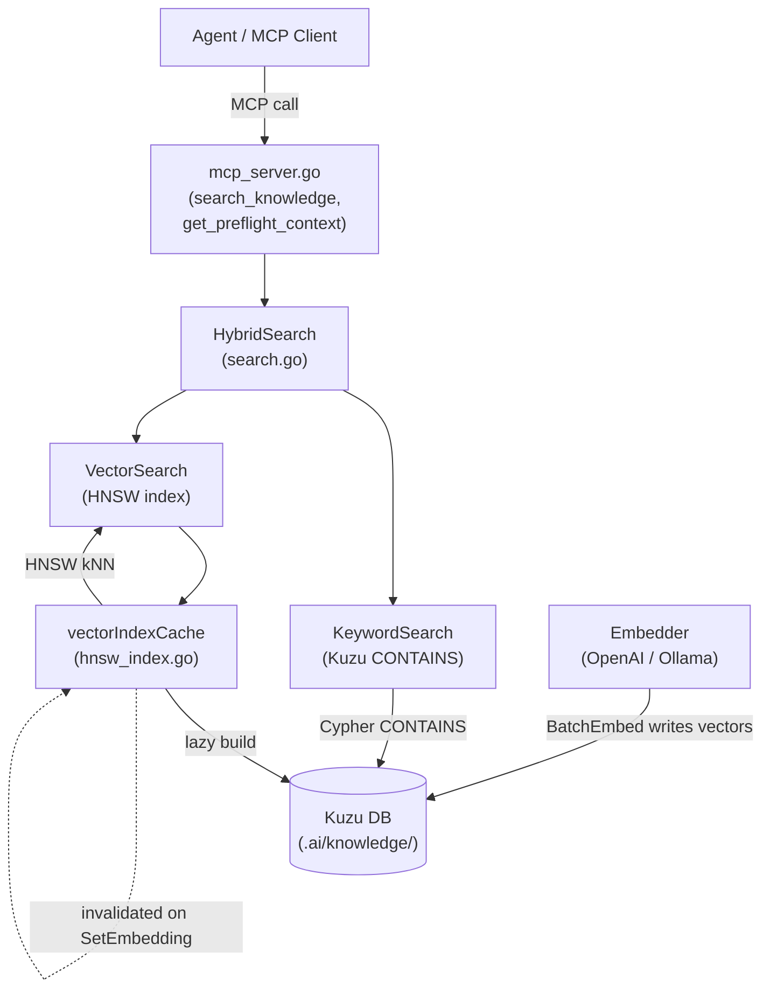
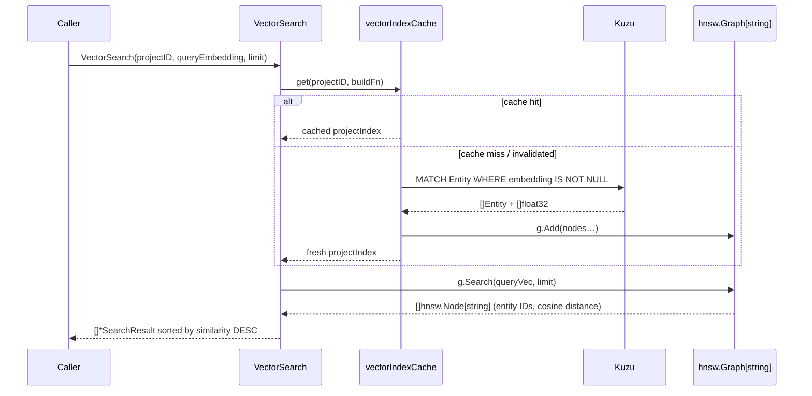
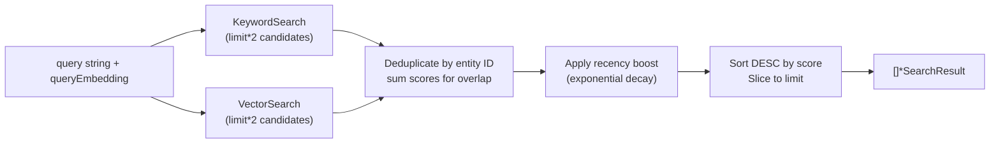
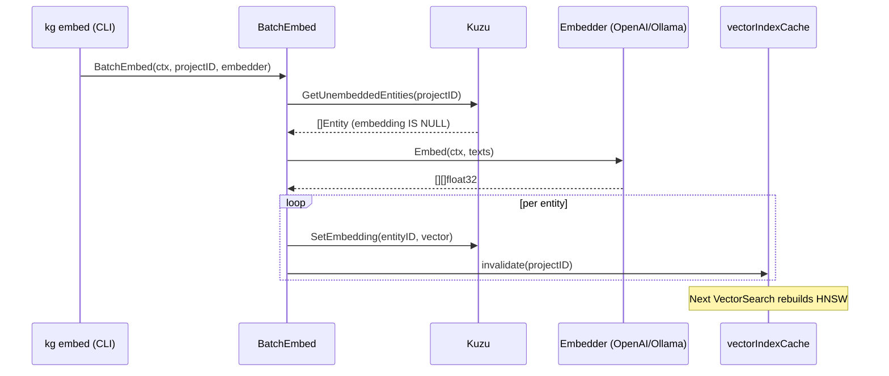
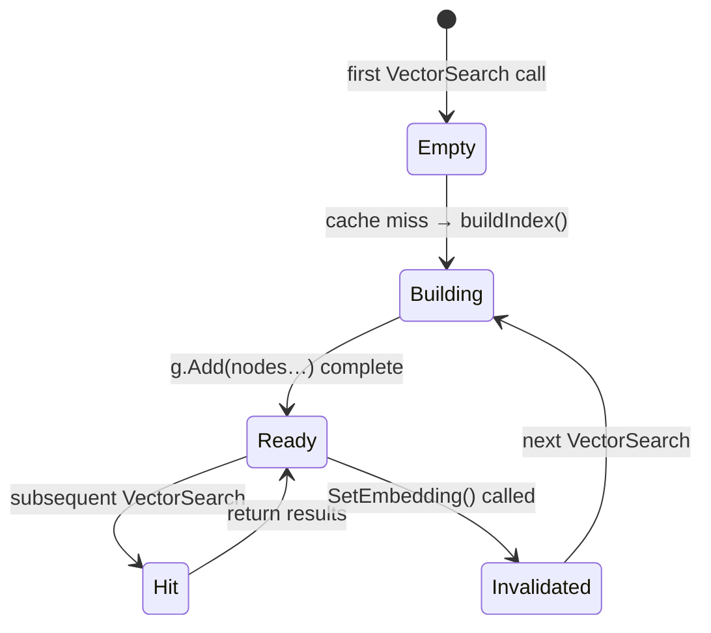

# Knowledge Graph Architecture

**Last updated:** 2026-02-25

Per-project knowledge graph that persists findings, code relationships, architectural
decisions, and incident history across agent sessions. Agents read from it via MCP tools;
the agent-server injects relevant context into the system prompt before each task starts.

For storage and build-tooling rationale see `docs/adr/003-knowledge-graph.md`.

---

## Table of Contents

1. [Motivation](#motivation)
2. [Component Overview](#component-overview)
3. [Schema](#schema)
4. [Search Layer](#search-layer)
5. [Embeddings](#embeddings)
6. [HNSW Index](#hnsw-index)
7. [Structural Indexer](#structural-indexer)
8. [MCP Interface](#mcp-interface)
9. [Cross-Platform Builds](#cross-platform-builds)
10. [Implementation History](#implementation-history)

---

## Motivation

Every agent session starts cold. The first 10–20 turns are spent re-reading files,
re-tracing call chains, and re-discovering facts already established in prior sessions.

The knowledge graph persists structured findings per project. Before each task, the
server queries it and injects relevant context into the system prompt — eliminating
investigation turns for known problem spaces.

---

## Component Overview

The `internal/knowledge/` package is split into distinct sub-concerns:

```
internal/knowledge/
├── store.go          — Kuzu DB wrapper (OpenStore, schema init)
├── entity.go         — CRUD for Entity nodes
├── observation.go    — CRUD for Observation nodes
├── relation.go       — CRUD for Relation edges
├── types.go          — Entity, Relation, Observation structs
├── embedder.go       — Embedder interface
├── embedder_openai.go — OpenAI text-embedding-3-small backend
├── embedder_ollama.go — Ollama (local) backend
├── embeddings.go     — BatchEmbed (bulk un-embedded entity processing)
├── hnsw_index.go     — In-memory HNSW index (vectorIndexCache, buildIndex)
├── search.go         — KeywordSearch, VectorSearch, HybridSearch
├── indexer.go        — Structural source-file scanner
├── preflight.go      — Pre-task context injection
└── mcp_server.go     — MCP tool server over stdio
```

### Data flow



---

## Schema

Stored in Kuzu (embedded columnar graph DB, no server required).

### Node tables

```cypher
CREATE NODE TABLE IF NOT EXISTS Entity (
    id          STRING,
    project_id  STRING,
    name        STRING,
    type        STRING,
    updated_at  TIMESTAMP,
    created_at  TIMESTAMP,
    embedding   FLOAT[1536],   -- null until BatchEmbed runs
    PRIMARY KEY (id)
)

CREATE NODE TABLE IF NOT EXISTS Observation (
    id          STRING,
    entity_id   STRING,
    content     STRING,
    created_at  TIMESTAMP,
    PRIMARY KEY (id)
)
```

### Edge tables

```cypher
CREATE REL TABLE IF NOT EXISTS HAS_OBSERVATION (FROM Entity TO Observation)
CREATE REL TABLE IF NOT EXISTS RELATES_TO      (FROM Entity TO Entity, type STRING)
CREATE REL TABLE IF NOT EXISTS CALLS           (FROM Entity TO Entity)
CREATE REL TABLE IF NOT EXISTS IMPORTS         (FROM Entity TO Entity)
CREATE REL TABLE IF NOT EXISTS CONTAINS        (FROM Entity TO Entity)
```

---

## Search Layer

Hybrid search combines keyword matching and vector similarity. Results are merged,
deduplicated, and re-ranked with a configurable weighted formula before being returned.

### Keyword Search

`KeywordSearch` issues a Cypher `CONTAINS` predicate over `name` and `summary` fields:

```cypher
MATCH (n:Entity {project_id: $project})
WHERE n.name CONTAINS $term OR n.summary CONTAINS $term
RETURN n ORDER BY n.updated_at DESC LIMIT 20
```

For stemmed full-text search, a secondary FTS index may be added in a future iteration.
`CONTAINS` is sufficient for the current workload.

### Vector Search

`VectorSearch` resolves the nearest-neighbour set via the **in-memory HNSW index**
(see [HNSW Index](#hnsw-index) below). It does **not** perform a linear scan of all
entity embeddings.



Cosine similarity is computed **inside the HNSW graph** using `hnsw.CosineDistance`
(from `github.com/coder/hnsw`). The result set contains only the _k_ nearest
neighbours — not all embedded entities.

### Hybrid Ranking

`HybridSearch` runs both paths and merges results:

```
finalScore = keywordScore + semanticScore + β * recencyScore
```

Where:
- `keywordScore` — normalised keyword match score (α weight default 0.4)
- `semanticScore` — cosine similarity score from HNSW (1-α weight default 0.6)
- `recencyScore` — exponential decay, half-life ≈ 21 days
- `β` — recency weight, default 0.1

Entities appearing in both keyword and vector results have their scores summed
(additive fusion) and their `MatchType` set to `"hybrid"`.



---

## Embeddings

### Interface

```go
type Embedder interface {
    Embed(ctx context.Context, texts []string) ([][]float32, error)
    Dimensions() int
    Model() string
}
```

### Implementations

| Backend | Model | Dims | Cost |
|---------|-------|------|------|
| OpenAI (default) | `text-embedding-3-small` | 1536 | ~$0.02/1M tokens |
| Ollama (local) | `nomic-embed-text` | 768 | Free |

Configured via `KNOWLEDGE_EMBED_MODEL` env var or `.ai/knowledge.toml`.

### Embedding Lifecycle

Embeddings are generated **on demand** via the `BatchEmbed` function — there is no
background scheduler. The typical lifecycle is:

1. **Write** — entities and observations are written to Kuzu without embeddings
   (`embedding` column remains `NULL`).
2. **BatchEmbed** — called explicitly (e.g. by the CLI `kg embed` command or the
   structural indexer after a bulk load). It queries for entities with `embedding IS NULL`,
   batches their text, calls the configured `Embedder`, and writes vectors back via
   `SetEmbedding`.
3. **Invalidation** — every `SetEmbedding` call invalidates the HNSW cache for that
   project, so the next `VectorSearch` will rebuild the index from the updated Kuzu data.



---

## HNSW Index

The in-memory HNSW (Hierarchical Navigable Small World) index replaces the previous
linear cosine-scan approach. It enables sub-linear approximate nearest-neighbour
search as the entity count grows.

### Library

`github.com/coder/hnsw` — distance function set to `hnsw.CosineDistance`.

### Structure

```go
type projectIndex struct {
    graph    *hnsw.Graph[string]  // node key = entity ID string
    entities map[string]*Entity   // entity ID → Entity metadata
    builtAt  time.Time
}

type vectorIndexCache struct {
    mu      sync.Mutex
    indices map[string]*projectIndex // project ID → index
}
```

One `projectIndex` per project. The graph nodes carry entity IDs as keys; metadata
is stored in the parallel `entities` map to avoid a second Kuzu round-trip during search.

### Lifecycle



| Event | Action |
|-------|--------|
| First `VectorSearch` for project | `buildIndex()` queries all embedded entities, constructs graph |
| `SetEmbedding` called | `vectorIndexCache.invalidate(projectID)` removes cached index |
| Subsequent `VectorSearch` after invalidation | `buildIndex()` runs again (fresh data) |
| Concurrent warm-up requests | Both may build; last writer wins (idempotent) |

### Build query

```cypher
MATCH (e:Entity)
WHERE e.project_id = $project AND e.embedding IS NOT NULL
RETURN e.id, e.name, e.type, e.project_id, e.created_at, e.updated_at, e.embedding
```

All embedded entities for the project are loaded into memory once. The graph is then
queried with `g.Search(queryVec, limit)` for approximate nearest neighbours.

---

## Structural Indexer

The `Indexer` (`indexer.go`) scans source files and populates the graph with
code-structure entities.

### Go AST Scanner

Walks Go source with `go/parser` and `go/ast`:
- Top-level `func` and `type` declarations → `Entity{type: "function" | "type"}`
- Import paths → `IMPORTS` relations

### File Graph Scanner

Language-agnostic for non-Go files:
- TypeScript/JS: regex import extraction → `IMPORTS` relations
- All files: directory hierarchy → `CONTAINS` relations

### Bulk Load

Structural scan outputs CSVs, loaded via Kuzu's `COPY FROM`:
```cypher
COPY Entity FROM 'entities.csv'
COPY IMPORTS FROM 'imports.csv'
```
Scanning 1000+ files takes seconds with bulk load vs. thousands of individual inserts.

---

## MCP Interface

`mcp_server.go` exposes `Store` methods as MCP tools over stdio:

| Tool | Description |
|------|-------------|
| `get_preflight_context` | Returns formatted context block for a task description |
| `search_knowledge` | `HybridSearch` — keyword + vector, returns top-N entities |
| `create_entities` | Bulk-upsert entities |
| `create_relations` | Bulk-upsert relations |
| `add_observations` | Append observations to entities |
| `delete_entities` | Remove entities and their relations |
| `delete_observations` | Remove specific observations |
| `delete_relations` | Remove specific relations |
| `read_graph` | Return full project graph (entities + relations) |
| `open_nodes` | Retrieve specific entities by name |

The MCP server is started by `cmd/kg mcp` and discovered by the agent via its
`.ai/mcp-servers.json` entry.

---

## Cross-Platform Builds

CGO is required only for `cmd/kg`. `cmd/server` and all other binaries are pure Go.
`Makefile` targets provide distinct build steps:

```makefile
build-kg:     # CGO_ENABLED=1, requires kuzu shared library
build-server: # CGO_ENABLED=0, pure Go
```

The Kuzu shared library (`libkuzu`) is vendored in `vendor/kuzu/` and linked
statically on Linux CI.

---

## Implementation History

| Phase | Task | Status | Description |
|-------|------|--------|-------------|
| 0 | ai-pack-asy | ✅ Complete | Module restructure — split `cmd/` and `internal/` |
| 1 | ai-pack-8ze | ✅ Complete | Kuzu store + schema (Entity, Observation, Relation tables) |
| 2 | ai-pack-gwe | ✅ Complete | Search layer — KeywordSearch + initial HybridSearch |
| 3 | ai-pack-bjj | ✅ Complete | Embeddings — Embedder interface, OpenAI + Ollama backends |
| 4 | ai-pack-21j | ✅ Complete | CLI (`kg index`, `kg embed`, `kg search`, `kg mcp`) |
| 5 | ai-pack-kmp | ✅ Complete | MCP server (`mcp_server.go`) |
| 6 | ai-pack-l7o | ✅ Complete | Real VectorSearch with cosine similarity |
| 7 | ai-pack-g2e | ✅ Complete | Structural indexer (Go AST + file graph scanner) |
| 8 | ai-pack-aru | ✅ Complete | In-memory HNSW index replacing linear cosine scan |
