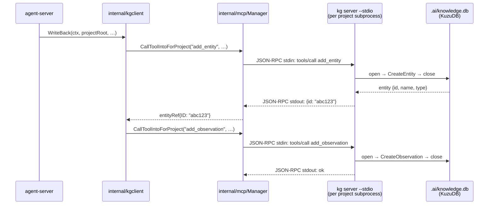
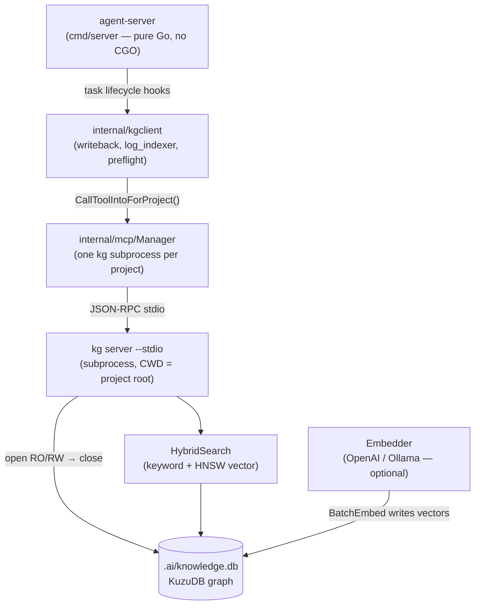
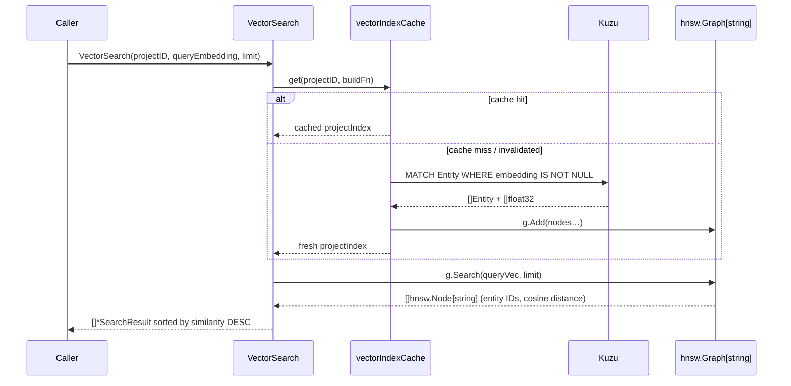
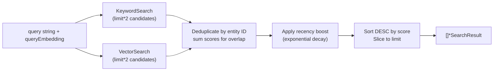
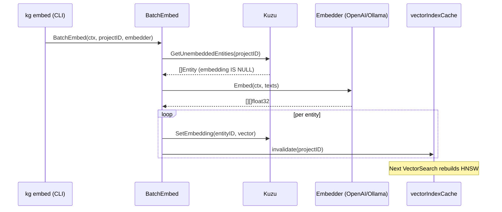
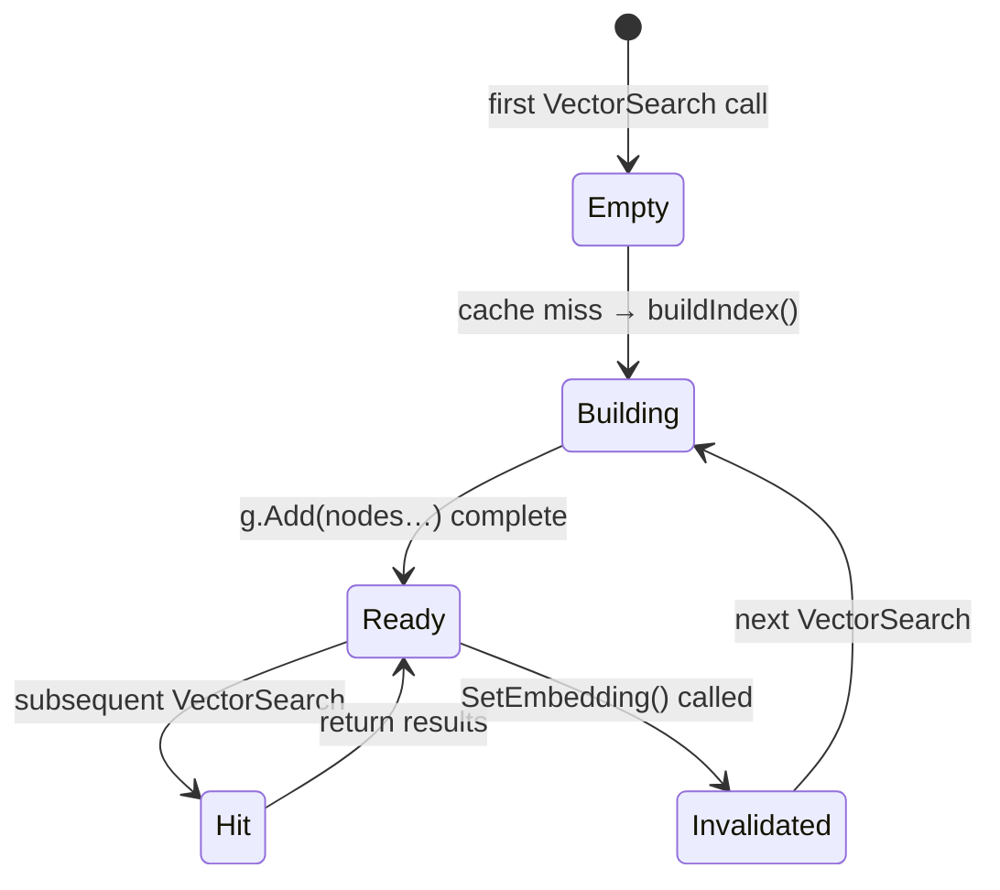

# Knowledge Graph Architecture

**Last updated:** 2026-04-16

Per-project knowledge graph that persists findings, code relationships, architectural
decisions, and incident history across agent sessions. Agents read from it via MCP tools;
the agent-server injects relevant context into the system prompt before each task starts.

**The `kg` binary is a standalone MCP server** — it lives in a separate repository
(`~/Projects/Vibe/mcp/src/kg/`, module `github.com/cortexa-llc/mcp/kg`) and is
installed independently. ai-pack has no in-process KuzuDB dependency; all knowledge
graph access is via MCP subprocess calls.

For storage and build-tooling rationale see `docs/adr/003-knowledge-graph.md`.

---

## Table of Contents

1. [Motivation](#motivation)
2. [Component Overview](#component-overview)
3. [Schema](#schema)
4. [Search Layer](#search-layer)
5. [Embeddings](#embeddings)
6. [HNSW Index](#hnsw-index)
7. [Structural Indexer](#structural-indexer)
8. [MCP Interface](#mcp-interface)
9. [Cold Start / Empty Graph](#cold-start--empty-graph)
10. [Write Durability](#write-durability)
11. [Cross-Platform Builds](#cross-platform-builds)
12. [Implementation History](#implementation-history)

---

## Motivation

Every agent session starts cold. The first 10–20 turns are spent re-reading files,
re-tracing call chains, and re-discovering facts already established in prior sessions.

The knowledge graph persists structured findings per project. Before each task, the
server queries it and injects relevant context into the system prompt — eliminating
investigation turns for known problem spaces.

---

## Component Overview

The knowledge graph implementation lives **entirely in the standalone `kg` binary**
(`~/Projects/Vibe/mcp/src/kg/`, module `github.com/cortexa-llc/mcp/kg`,
installed to `/usr/local/bin/kg`). ai-pack contains only a thin client layer:

```
ai-pack (this repo)
└── internal/kgclient/
    ├── writeback.go      — WriteBack, WriteAgentReasoning (task outcome → KG)
    ├── log_indexer.go    — IndexExecutionLog (execution.log metrics → KG)
    └── preflight.go      — PreflightContext, ParseRelatedProjects

kg binary (~/Projects/Vibe/mcp/src/kg/)
├── internal/knowledge/
│   ├── store.go               — KuzuDB wrapper (OpenStore, OpenStoreReadOnly, schema init)
│   ├── entity.go / observation.go / relation.go / types.go
│   ├── embedder*.go           — Embedder interface, OpenAI + Ollama backends
│   ├── embeddings.go          — BatchEmbed (bulk un-embedded entity processing)
│   ├── hnsw_index.go          — In-memory HNSW index (vectorIndexCache, buildIndex)
│   ├── search.go              — KeywordSearch, VectorSearch, HybridSearch
│   ├── indexer*.go            — Structural source-file scanner (tree-sitter, 14+ languages)
│   └── mcp_server.go          — MCP tool server over stdio (open-use-close per call)
└── *.go                       — CLI commands (kg index, kg search, kg server, …)
```

### Per-project database isolation

Each project gets its own `.ai/knowledge.db`. The `kg` binary auto-discovers the
correct database by walking up from its **working directory** to find a `.ai/`
directory, a git root, or a common project marker (`go.mod`, `package.json`, etc.).

`internal/mcp/Manager` spawns one `kg server --stdio` subprocess **per project root**,
with that project directory as the subprocess CWD. This ensures every project sees its
own isolated graph with no additional configuration.

```
agent-server spawns:
  kg server --stdio  (CWD=/Users/bryanw/Projects/Vibe/ai-pack)  → ai-pack/.ai/knowledge.db
  kg server --stdio  (CWD=/Users/bryanw/Projects/HomeControl)    → HomeControl/.ai/knowledge.db
  kg server --stdio  (CWD=/Users/bryanw/Projects/xasm)           → xasm/.ai/knowledge.db
```

The subprocess is persistent for the lifetime of the agent-server session — it is
spawned on first use for a project and reused for all subsequent tool calls to that
project's graph within the session.

### MCP interaction model

`internal/mcp/Manager` communicates with each `kg server --stdio` subprocess over
JSON-RPC on stdin/stdout. Within `kg`, each tool call uses an **open-use-close**
pattern: it opens KuzuDB, executes the operation, and closes the connection before
returning the response. No KuzuDB write lock is held between calls.



### Why kgclient uses MCP — not direct KuzuDB access

KuzuDB allows only one writer at a time. If `internal/kgclient` opened KuzuDB
in-process inside `agent-server`, it would compete for the write lock with the
already-running `kg server --stdio` subprocess — causing operations like `kg stats`
to hang indefinitely.

`internal/kgclient` communicates exclusively through `mcpManager.CallToolIntoForProject()`.
The only KG-typed value in kgclient is a minimal local struct:

```go
// entityRef is the only KG type used by kgclient —
// the minimal JSON shape returned by add_entity.
type entityRef struct {
    ID string `json:"id"`
}
```

ai-pack has **no CGO dependency** and no KuzuDB import. The full KuzuDB + CGO
surface is contained inside the standalone `kg` binary.

### Data flow (high-level)



---

## Schema

Stored in Kuzu (embedded columnar graph DB, no server required).

### Node tables

```cypher
CREATE NODE TABLE IF NOT EXISTS Entity (
    id          STRING,
    project_id  STRING,
    name        STRING,
    type        STRING,
    updated_at  TIMESTAMP,
    created_at  TIMESTAMP,
    embedding   FLOAT[1536],   -- null until BatchEmbed runs
    PRIMARY KEY (id)
)

CREATE NODE TABLE IF NOT EXISTS Observation (
    id          STRING,
    entity_id   STRING,
    content     STRING,
    created_at  TIMESTAMP,
    PRIMARY KEY (id)
)
```

### Edge tables

```cypher
CREATE REL TABLE IF NOT EXISTS HAS_OBSERVATION (FROM Entity TO Observation)
CREATE REL TABLE IF NOT EXISTS RELATES_TO      (FROM Entity TO Entity, type STRING)
CREATE REL TABLE IF NOT EXISTS CALLS           (FROM Entity TO Entity)
CREATE REL TABLE IF NOT EXISTS IMPORTS         (FROM Entity TO Entity)
CREATE REL TABLE IF NOT EXISTS CONTAINS        (FROM Entity TO Entity)
CREATE REL TABLE IF NOT EXISTS IMPLEMENTS      (FROM Entity TO Entity)
CREATE REL TABLE IF NOT EXISTS BELONGS_TO      (FROM Entity TO Entity)
CREATE REL TABLE IF NOT EXISTS DEPENDS_ON      (FROM Entity TO Entity)
```

---

## Search Layer

Hybrid search combines keyword matching and vector similarity. Results are merged,
deduplicated, and re-ranked with a configurable weighted formula before being returned.

### Keyword Search

`KeywordSearch` issues a Cypher `CONTAINS` predicate over `name` and `summary` fields:

```cypher
MATCH (n:Entity {project_id: $project})
WHERE n.name CONTAINS $term OR n.summary CONTAINS $term
RETURN n ORDER BY n.updated_at DESC LIMIT 20
```

For stemmed full-text search, a secondary FTS index may be added in a future iteration.
`CONTAINS` is sufficient for the current workload.

### Vector Search

`VectorSearch` resolves the nearest-neighbour set via the **in-memory HNSW index**
(see [HNSW Index](#hnsw-index) below). It does **not** perform a linear scan of all
entity embeddings.



Cosine similarity is computed **inside the HNSW graph** using `hnsw.CosineDistance`
(from `github.com/coder/hnsw`). The result set contains only the _k_ nearest
neighbours — not all embedded entities.

### Hybrid Ranking

`HybridSearch` runs both paths and merges results:

```
finalScore = keywordScore + semanticScore + β * recencyScore
```

Where:
- `keywordScore` — normalised keyword match score (α weight default 0.4)
- `semanticScore` — cosine similarity score from HNSW (1-α weight default 0.6)
- `recencyScore` — exponential decay, half-life ≈ 21 days
- `β` — recency weight, default 0.1

Entities appearing in both keyword and vector results have their scores summed
(additive fusion) and their `MatchType` set to `"hybrid"`.



---

## Embeddings

### Interface

```go
type Embedder interface {
    Embed(ctx context.Context, texts []string) ([][]float32, error)
    Dimensions() int
    Model() string
}
```

### Implementations

| Backend | Model | Dims | Cost |
|---------|-------|------|------|
| OpenAI (default) | `text-embedding-3-small` | 1536 | ~$0.02/1M tokens |
| Ollama (local) | `nomic-embed-text` | 768 | Free |

Configured via `KNOWLEDGE_EMBED_MODEL` env var or `.ai/knowledge.toml`.

### Embedding Lifecycle

Embeddings are generated **on demand** via the `BatchEmbed` function — there is no
background scheduler. The typical lifecycle is:

1. **Write** — entities and observations are written to Kuzu without embeddings
   (`embedding` column remains `NULL`).
2. **BatchEmbed** — called explicitly (e.g. by the CLI `kg embed` command or the
   structural indexer after a bulk load). It queries for entities with `embedding IS NULL`,
   batches their text, calls the configured `Embedder`, and writes vectors back via
   `SetEmbedding`.
3. **Invalidation** — every `SetEmbedding` call invalidates the HNSW cache for that
   project, so the next `VectorSearch` will rebuild the index from the updated Kuzu data.



---

## HNSW Index

The in-memory HNSW (Hierarchical Navigable Small World) index replaces the previous
linear cosine-scan approach. It enables sub-linear approximate nearest-neighbour
search as the entity count grows.

### Library

`github.com/coder/hnsw` — distance function set to `hnsw.CosineDistance`.

### Structure

```go
type projectIndex struct {
    graph    *hnsw.Graph[string]  // node key = entity ID string
    entities map[string]*Entity   // entity ID → Entity metadata
    builtAt  time.Time
}

type vectorIndexCache struct {
    mu      sync.Mutex
    indices map[string]*projectIndex // project ID → index
}
```

One `projectIndex` per project. The graph nodes carry entity IDs as keys; metadata
is stored in the parallel `entities` map to avoid a second Kuzu round-trip during search.

### Lifecycle



| Event | Action |
|-------|--------|
| First `VectorSearch` for project | `buildIndex()` queries all embedded entities, constructs graph |
| `SetEmbedding` called | `vectorIndexCache.invalidate(projectID)` removes cached index |
| Subsequent `VectorSearch` after invalidation | `buildIndex()` runs again (fresh data) |
| Concurrent warm-up requests | Both may build; last writer wins (idempotent) |

### Build query

```cypher
MATCH (e:Entity)
WHERE e.project_id = $project AND e.embedding IS NOT NULL
RETURN e.id, e.name, e.type, e.project_id, e.created_at, e.updated_at, e.embedding
```

All embedded entities for the project are loaded into memory once. The graph is then
queried with `g.Search(queryVec, limit)` for approximate nearest neighbours.

---

## Structural Indexer

The `Indexer` (`indexer.go`) scans source files and populates the graph with
code-structure entities.  `kg index` runs it from the CLI; agents can trigger it
via the `index_project` MCP tool.

### Language Support

| Extractor | Languages / Files | Method |
|-----------|-------------------|--------|
| `indexer_treesitter.go` | Go, Python, Java, Kotlin, C, C++, Rust, Swift, Ruby, C#, JS, TS, TSX | Tree-sitter AST |
| `indexer_yaml.go` | `.yaml`, `.yml` | Tree-sitter |
| `indexer_html.go` | `.html`, `.htm` | Tree-sitter |
| `indexer_markdown.go` | `.md` | Tree-sitter |
| `indexer_graphql.go` | `.graphql`, `.graphqls`, `.gql` | Regex/line-scan |
| `indexer_jsonschema.go` | `*.schema.json`, `schema.json`, `*.json` with `"$schema"` key | encoding/json |
| `indexer_makefile.go` | `Makefile`, `*.mk`, `*.make`, `MAKE*.txt`, `CMakeLists.txt`, `*.cmake` | Regex/line-scan |
| `indexer_asm.go` | `.s`, `.asm`, `.S` | Regex/line-scan |

### What gets indexed

| Entity type | Examples |
|-------------|---------|
| `function` | Go `func`, Python `def`, TS arrow function, Query/Mutation fields in GraphQL |
| `type` | Go/Java/C# types, Python classes, GraphQL types, JSON Schema $defs |
| `file` | Every scanned file |
| `import` | Go import paths, Python imports, find_package() in CMake |
| `package` | Go package declarations (BELONGS_TO relation) |
| `topic` | Markdown headings |

### Bulk Load (NDJSON)

Structural scan collects entities in memory, then bulk-loads via Kuzu's `COPY FROM`:

```cypher
COPY Entity(id, name, type, project_id, created_at, updated_at) FROM '/tmp/kg-entities-*.json'
COPY CONTAINS FROM '/tmp/kg-rels-CONTAINS-*.json'
COPY IMPORTS  FROM '/tmp/kg-rels-IMPORTS-*.json'
-- … one COPY per relation type
```

NDJSON avoids all CSV quoting edge-cases (CSS selectors, commas in names, Unicode).
Scanning ~550 files creates ~8K entities and ~18K relations in ~2.5 seconds.

---

## MCP Interface

`mcp_server.go` exposes the knowledge graph over the MCP stdio protocol.
It is started as `kg server --stdio`.

### Open-use-close design

Each tool call opens the Kuzu database, executes its operation, and closes the
connection before returning.  No lock is held between calls.  This means:

- `kg index` (CLI) can run at any time alongside a running `kg server`
- Multiple agent sessions sharing the same project can each open read-only
  connections concurrently
- Write calls (add_entity, add_observation, link_entities, index_project) briefly
  hold a write lock; concurrent write calls are serialized by Kuzu

### Tools

| Tool | DB mode | Description |
|------|---------|-------------|
| `get_preflight_context` | RO | Returns relevant entities for a task description; auto-called by agent-server before each task |
| `search_knowledge` | RO | Keyword search over entity names and observations (top-N, default 12) |
| `get_file_context` | RO | All entities defined in a specific file path |
| `query_graph` | RO | Read-only Cypher query (MATCH/RETURN only) |
| `add_entity` | RW | Create or upsert an entity (name + type); returns entity ID |
| `add_observation` | RW | Attach a text note to an existing entity |
| `link_entities` | RW | Create a directed relation between two entities |
| `index_project` | RW | Full codebase re-index (equivalent to `kg index` CLI but runs in-process) |

### Entity types for `add_entity`

`function`, `type`, `file`, `module`, `topic`, `package`, `import`

### Relations for `link_entities`

`CONTAINS`, `IMPORTS`, `CALLS`, `IMPLEMENTS`, `BELONGS_TO`, `DEPENDS_ON`, `RELATES_TO`

### Agent session configuration

`kg` is registered in `~/.claude/agent-server.json` under `mcp.servers` and
`mcp.enabled_servers`.  Re-run `python3 scripts/setup-mcp.py` to apply the
configuration to both Claude Code (interactive) and agent sessions.

```json
"mcp": {
  "enabled": true,
  "servers": { "kg": {"command": "kg", "args": ["server", "--stdio"]} },
  "enabled_servers": ["memory", "sequential-thinking", "kg"]
}
```

---

## Cold Start / Empty Graph

When a new project is initialized (or the Kuzu database file is absent), the knowledge
graph is **empty** — no entities, no vectors, no HNSW index.

### What happens on first access

| Operation | Empty-graph behaviour |
|-----------|----------------------|
| `HybridSearch` / `KeywordSearch` | Returns 0 results; no error |
| `VectorSearch` | Returns 0 results; HNSW build is skipped when entity count is 0 |
| `get_preflight_context` (MCP) | Returns an empty context block (empty string); the agent-server still proceeds and injects no prior knowledge |
| `BatchEmbed` | No-ops immediately (0 unembedded entities found) |

### Agent expectations

Agents MUST treat an empty or near-empty context as a valid state, not an error.  The
first few tasks on a new project are a "cold start" — the graph will be populated
incrementally as agents write findings back via the MCP write tools
(`add_entity`, `add_observation`, `link_entities`).

Quality improves as coverage builds.  Preflight context typically becomes useful after
2–5 tasks have written observations to the graph.

### Seeding (optional)

A project may be pre-seeded by running the structural indexer (`kg index`), which
scans source files across 14+ languages and bulk-loads entities and relations.
This gives agents immediate structural context even before any task runs.
Alternatively, agents can call `index_project` via MCP once the server is running.

---

## Write Durability

Kuzu writes issued through the MCP tools are **synchronous within the tool call** —
the Kuzu transaction is committed before the tool response is returned to the agent.
However, the agent-server dispatches write tool calls in a **fire-and-forget** fashion:
if the agent process is killed, the connection drops, or the MCP server crashes
between tool calls, in-flight writes may be lost.

**Practical implications:**

- Do **not** rely on an observation being visible to the *same* agent in the same
  session immediately after writing — reads issued before the round-trip completes may
  return stale data.
- Across sessions, knowledge written in session N is generally visible in session N+1
  because Kuzu flushes to disk before the tool response returns.  The risk window is
  limited to crashes during the write transaction itself.
- Embeddings are written separately by `BatchEmbed`, which runs after the entity write.
  An entity written but not yet embedded will appear in keyword search but not in
  vector/hybrid search until `BatchEmbed` is called.
- There is no write-ahead log or replication.  The Kuzu on-disk file is the single
  source of truth; database corruption from an OS crash is possible (though unlikely
  with default OS write-back caching).

**In summary:** writes are *best-effort durable*, not *guaranteed durable*.  Treat the
knowledge graph as a high-value cache, not as the system of record for agent outputs.

---

## Cross-Platform Builds

`cmd/server` and `cmd/agent` are pure Go — no CGO, no C++ toolchain required.

CGO is required only for the **standalone `kg` binary**, which is built and installed
separately from `~/Projects/Vibe/mcp/src/kg/`:

```bash
cd ~/Projects/Vibe/mcp/src/kg
make install        # CGO_ENABLED=1 — requires a C compiler (Xcode CLT / gcc)
# or via install.py:
python3 ~/Projects/Vibe/mcp/install.py --mcp kg
```

The `kg` binary statically links KuzuDB (`libkuzu.a`) — the result is a single
self-contained executable (~60–80MB). ai-pack's `Makefile` builds only `cmd/agent`
and `cmd/server`; there is no `build-kg` target.

---

## Implementation History

- Kuzu store + schema (Entity, Observation, Relation tables)
- Search layer — KeywordSearch, VectorSearch, HybridSearch
- Embeddings — Embedder interface, OpenAI + Ollama backends
- In-memory HNSW index for sub-linear approximate nearest-neighbour search
- CLI: `kg index`, `kg embed`, `kg search`, `kg server`
- MCP server over stdio (open-use-close per call)
- Structural indexer: tree-sitter (14 languages), YAML, HTML, Markdown, GraphQL, JSON Schema, Makefile/CMake, Assembly
- NDJSON bulk-load replacing CSV (2.4s for ~550 files / ~8K entities)
- Read-only store mode for concurrent search alongside indexing
- Project root auto-detection (`.ai/` walk → git → marker files)
- `index_project` MCP tool; kg wired into agent sessions via `agent-server.json`
- **2026-04-16**: Extracted `cmd/kg/` + `internal/knowledge/` to standalone module
  `github.com/cortexa-llc/mcp/kg` (`~/Projects/Vibe/mcp/src/kg/`). ai-pack no longer
  has any in-process KuzuDB access. `internal/kgclient` uses `entityRef{ID string}`
  as its only KG-typed value; all writes go through `mcpManager.CallToolIntoForProject()`.
  Fixes KuzuDB write-lock contention that caused `kg stats` to hang.
