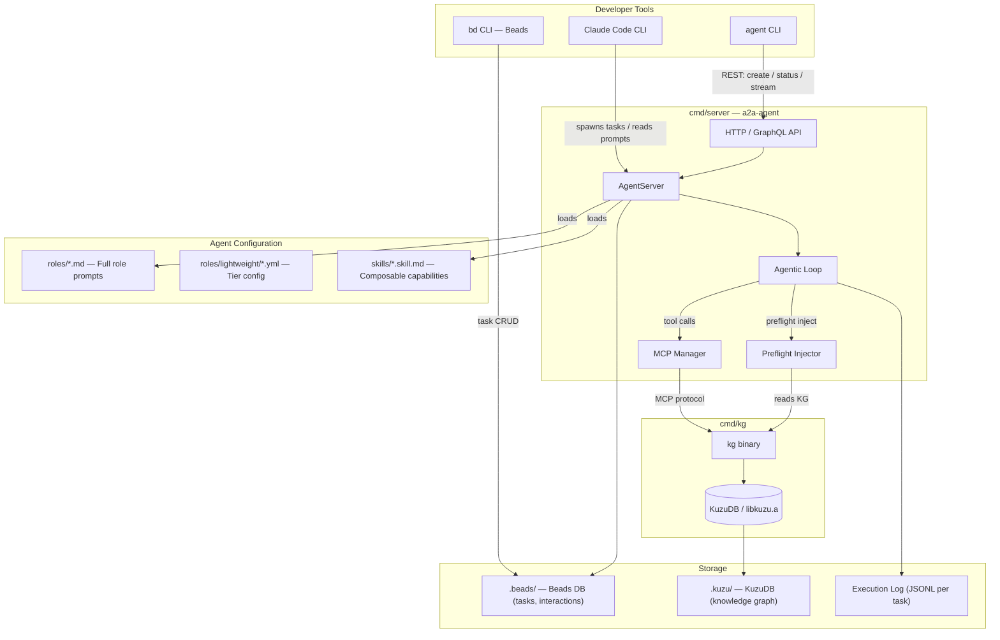

# AI-Pack System Architecture Overview

**Last updated:** 2026-04-09

AI-Pack is a multi-agent workflow framework for software development. It provides structured
roles, quality gates, and persistent memory to coordinate one or more AI agents (currently
Claude Code) across the full software-development lifecycle — from requirements through
implementation, review, and testing. The framework runs either locally (a Claude Code process
per task) or remotely (via an HTTP/A2A server that manages a pool of long-running agent
tasks).

---

## Table of Contents

1. [System Map](#system-map)
2. [Components](#components)
3. [Data Flow](#data-flow)
4. [Storage Layer](#storage-layer)
5. [Two-Tier Agent Model](#two-tier-agent-model)
6. [Roles and Skills](#roles-and-skills)
7. [Key Entry Points and Binaries](#key-entry-points-and-binaries)
8. [Related Documents](#related-documents)

---

## System Map



---

## Components

### `cmd/server` — a2a-agent server

The central HTTP server that creates and manages agent tasks. It exposes:

| Endpoint | Purpose |
|----------|---------|
| `POST /a2a/tasks` | Create and queue a new agent task |
| `GET  /a2a/tasks/{id}` | Poll task status |
| `GET  /stream/{id}` | SSE stream of live task events |
| `POST /graphql` | GraphQL API (GUI + tooling) |
| `GET  /health` | Liveness check |

The server owns the **agentic loop** — the turn-by-turn conversation with an LLM
(Anthropic / OpenAI), tool dispatch, streaming to clients, and Beads task-state updates.
Before each task starts, the **Preflight Injector** calls the KG MCP server to load
relevant prior knowledge into the agent's system prompt.

See [`docs/architecture/a2a-agent.md`](a2a-agent.md) for full internals.

---

### `cmd/agent` — agent CLI

A thin CLI client that speaks to the a2a-agent server. Primary commands:

| Command | Action |
|---------|--------|
| `agent spawn <role> <task>` | Create a new task on the server |
| `agent list` | List running / recent tasks |
| `agent status <id>` | Show task status and summary |
| `agent wait <id>` | Block until task completes |
| `agent logs <id>` | Stream or replay task events |

The `agent` CLI is how CI pipelines and orchestrators drive the server programmatically.

---

### `cmd/kg` — knowledge-graph binary

A self-contained binary that wraps KuzuDB. It serves two roles:

1. **MCP server** (`kg handle-server`) — Responds to MCP tool calls from the agentic loop
   (e.g., `kg__search_knowledge`, `kg__add_observation`, `kg__query_graph`).
2. **Admin CLI** — Direct graph commands: `kg add`, `kg link`, `kg index`, `kg export`, `kg gc`.

The binary statically links `libkuzu.a`, so no shared-library installation is required.
Each project's graph lives in `.kuzu/kg.db` relative to the project root.

---

### `bd` CLI — Beads task tracker

Beads is a separate task-management system (not built inside ai-pack). It tracks:
- Human-authored tasks and epics
- Agent-created sub-tasks (spawned during `orchestrator` execution)
- Task state: `open → claimed → closed / blocked`

The a2a-agent server embeds a Beads client (`internal/beads`) that updates task state
as agent tasks progress. Task state lives in `.beads/beads.db` (SQLite).

---

### MCP Manager (`internal/mcp`)

The MCP Manager multiplexes multiple MCP servers — one per project. When an agent task
needs to call a KG tool, the manager routes the call to the appropriate `kg handle-server`
process for that project's `.kuzu/` directory.

External MCP servers (e.g., Brave Search, Puppeteer) are configured in
`.claude/mcp-config.json` and proxied through the same manager.

---

## Data Flow

### Task Creation → Execution → Result

```
Developer
  │
  ├─ Claude Code: reads roles/*.md, spawns Claude subprocess
  │         OR
  └─ agent spawn → POST /a2a/tasks
                      │
               AgentServer creates TaskExecution
                      │
               Preflight Injector
                 └─ kg get_preflight_context → injects KG context into system prompt
                      │
               Agentic Loop begins
                 ├─ Send prompt + tools to LLM (Anthropic / OpenAI)
                 ├─ Stream tokens → SSE /stream/{id}
                 ├─ Tool calls dispatched:
                 │    ├─ KG tools → MCP Manager → kg handle-server → KuzuDB
                 │    ├─ Beads tools → internal/beads → .beads/beads.db
                 │    └─ File / shell tools → Claude Code sandbox
                 ├─ Tool results appended to conversation
                 └─ Repeat until task complete or stop condition
                      │
               Task result written to Beads + ExecutionLog
               KG writeback: exec entity + observations stored
```

---

## Storage Layer

Two persistent stores, each with a distinct purpose:

| Store | Location | Contents | Owner |
|-------|----------|----------|-------|
| **KuzuDB** | `.kuzu/kg.db` | Code entities, functions, types, architectural observations, ADRs, task execution history | `cmd/kg` binary (MCP + CLI) |
| **Beads DB** | `.beads/beads.db` | Task definitions, epics, statuses, human-agent interactions | `bd` CLI + `internal/beads` client |
| **Execution Log** | `.beads/tasks/{id}/` | JSONL event log of every LLM turn, tool call, and result for replay | a2a-agent server |

**KuzuDB** is a graph database — entities (functions, types, topics, files) connected by
typed edges (CALLS, IMPORTS, DEPENDS_ON, etc.). It is the agent's long-term memory:
the KG persists code relationships and prior-investigation findings across sessions.

**Beads DB** is a relational store (SQLite/Dolt) for project management state. Tasks have
explicit lifecycle states, owners, and parent/child relationships. The `bd` CLI is the
human interface; the server updates task state programmatically.

See [`docs/adr/003-knowledge-graph.md`](../adr/003-knowledge-graph.md) for the KuzuDB
storage rationale, and [`docs/architecture/knowledge-graph.md`](knowledge-graph.md) for
the full KG internals.

---

## Two-Tier Agent Model

AI-Pack supports two execution tiers for agents (see
[`docs/adr/001-two-tier-agent-architecture.md`](../adr/001-two-tier-agent-architecture.md)):

### Tier 1 — Lightweight (Claude Code native)

Claude Code runs as the agent runtime. The role prompt is loaded directly from
`roles/*.md` and injected into the system prompt. Tools available are whatever Claude Code
exposes natively (Read, Write, Edit, Bash, Grep, etc.) plus any MCP servers configured in
`.claude/mcp-config.json`.

**When used:** Local development, single-agent workflows, tasks spawned directly by
an orchestrator within a Claude Code session.

**Configuration:** `roles/lightweight/*.yml` describes each role's tier, tools, gates,
and delegation mode.

### Tier 2 — Remote (a2a-agent server)

The a2a-agent server manages the LLM conversation loop itself. Claude Code (or another
LLM) is called via the Anthropic/OpenAI API with the full role prompt, tool definitions,
and preflight KG context. Results are streamed back over SSE and stored in the execution
log.

**When used:** CI/CD pipelines, GUI-driven tasks, multi-agent orchestration, tasks
requiring server-side state management.

**Configuration:** `roles/*.md` (full prompt) + server role config.

```
┌─────────────────────────────────────────────────────┐
│           Tier 1: Lightweight (Claude Code)         │
│  Claude Code subprocess                             │
│  └─ reads roles/*.md for system prompt             │
│  └─ MCP tools from .claude/mcp-config.json         │
└─────────────────────────────────────────────────────┘

┌─────────────────────────────────────────────────────┐
│           Tier 2: Remote (a2a-agent server)         │
│  cmd/server process                                 │
│  └─ HTTP API (agent CLI / GUI / CI)                │
│  └─ Agentic loop: LLM API + tool dispatch          │
│  └─ MCP Manager: routes tool calls per project     │
│  └─ Preflight: KG context injected before task     │
└─────────────────────────────────────────────────────┘
```

---

## Roles and Skills

### Roles (`roles/*.md`)

Each role is a markdown file that forms the agent's system prompt. Roles define:
- **Identity and purpose** (e.g., Engineer, Orchestrator, Reviewer)
- **Responsibilities and procedures**
- **Tool permissions** (which tools the role may use)
- **Quality gates** (checks that must pass before output is accepted)

Current roles: `orchestrator`, `engineer`, `architect`, `reviewer`, `tester`,
`product-manager`, `designer`, `spelunker`, `archaeologist`, `inspector`, `strategist`.

### Skills (`skills/*.skill.md`)

Skills are composable capability fragments injected into role prompts at task time
(see [`docs/adr/004-role-skill-ocp.md`](../adr/004-role-skill-ocp.md)). A skill adds a
focused capability (e.g., `kg_reader`, `kg_writer`, `code_review`, `tdd`) without
modifying the base role file.

The skill composition algorithm merges skill tool lists, gates, and prompt sections into
the resolved role prompt. This keeps roles closed to modification and open to extension.

See [`docs/architecture/skill-schema.md`](skill-schema.md) and
[`docs/architecture/skill-composition.md`](skill-composition.md) for details.

---

## Key Entry Points and Binaries

| Binary | Source | Purpose |
|--------|--------|---------|
| `a2a-agent` | `cmd/server/main.go` | HTTP server, agentic loop, MCP management |
| `agent` | `cmd/agent/main.go` | CLI client for the server |
| `kg` | `cmd/kg/main.go` | KuzuDB MCP server + admin CLI |
| `bd` | (external) | Beads task tracker CLI |

### Build

```bash
make build        # builds all three Go binaries
make setup-kuzu   # downloads libkuzu.a for current platform (required before building kg)
```

The `kg` binary requires `lib/kuzu/<platform>/libkuzu.a` to be populated before
compilation. Use `make setup-kuzu` or `scripts/download-kuzu.sh`.

---

## Related Documents

| Document | What it covers |
|----------|---------------|
| [`docs/architecture/a2a-agent.md`](a2a-agent.md) | Deep dive: server internals, HTTP API, task lifecycle, SSE streaming |
| [`docs/architecture/knowledge-graph.md`](knowledge-graph.md) | KG motivation, entity model, MCP tool list, writeback patterns |
| [`docs/architecture/skill-schema.md`](skill-schema.md) | Skill file format reference |
| [`docs/architecture/skill-composition.md`](skill-composition.md) | Skill merge algorithm |
| [`docs/adr/001-two-tier-agent-architecture.md`](../adr/001-two-tier-agent-architecture.md) | Two-tier agent design rationale |
| [`docs/adr/002-sse-task-stream-heartbeat.md`](../adr/002-sse-task-stream-heartbeat.md) | SSE heartbeat / reconnection design |
| [`docs/adr/003-knowledge-graph.md`](../adr/003-knowledge-graph.md) | KuzuDB choice, static linking, storage topology |
| [`docs/adr/004-role-skill-ocp.md`](../adr/004-role-skill-ocp.md) | OCP-based skill composition |
| [`docs/adr/006-role-extension-ocp.md`](../adr/006-role-extension-ocp.md) | Role extension mechanism |
| [`docs/adr/008-shared-dolt-service.md`](../adr/008-shared-dolt-service.md) | Shared Dolt server for multi-project task tracking |
| [`docs/guides/shared-dolt-service.md`](../guides/shared-dolt-service.md) | Setup and adoption guide for the shared Dolt pattern |
