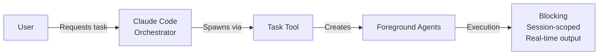
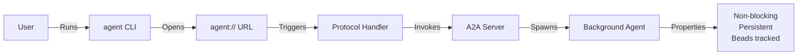
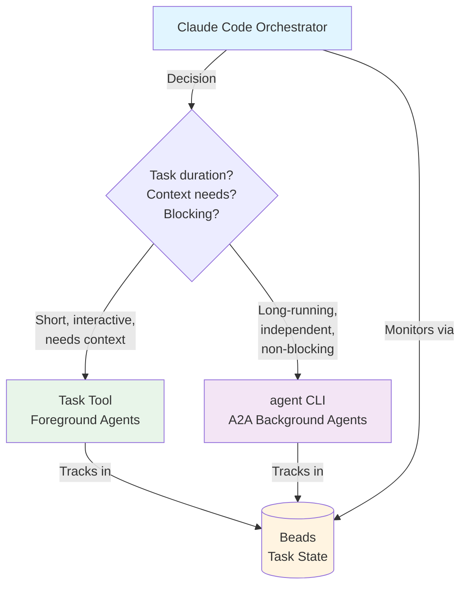

# Orchestrator and A2A Agent System Integration

## Current State: Integrated Dual Agent Systems

The ai-pack framework provides **two complementary agent spawning systems** that Orchestrator can use based on task requirements:

1. **Claude Code's Task Tool** - Spawns foreground agents for immediate, interactive work
2. **AI-Pack A2A Server** - Spawns background agents via `agent` CLI for long-running, persistent tasks

The Orchestrator role is configured to use **both systems** and choose the appropriate one based on task characteristics.

This document explains when to use each system, how Orchestrator coordinates both, and best practices for mixed workflows.

---

## System 1: Claude Code Orchestrator

### What It Is

The Orchestrator is a **built-in Claude Code role** that coordinates complex multi-step tasks by delegating work to specialized sub-agents.

### How It Works



### Agent Spawning

The Orchestrator uses Claude Code's **Task tool** to spawn agents:

```
Task(
  subagent_type="general-purpose",
  prompt="Implement feature X",
  description="Implementing feature X"
)
```

### Characteristics

- **Foreground Agents**: Execute in the current Claude Code session
- **Blocking**: Orchestrator waits for agent completion
- **Session-Scoped**: Agent state lives only in current session
- **Terminal Output**: Progress visible in real-time
- **No Persistence**: Agent state not persisted after session ends
- **Context Source**: Task description and task packet (NOT conversation history)

### When to Use

- Complex tasks requiring coordination within a **single session**
- Tasks requiring **immediate results** for next step
- Tasks requiring **real-time progress visibility**
- Tasks where you want to **block and wait** for completion
- Short-duration tasks (less than 10 minutes)

### Example

```bash
# User works with Claude Code in Orchestrator mode
claude> "Implement authentication, add tests, and update docs"

# Orchestrator spawns multiple Task tool agents internally:
# - Agent 1: Implements auth (blocks, completes)
# - Agent 2: Writes tests (blocks, completes)
# - Agent 3: Updates docs (blocks, completes)
```

---

## System 2: AI-Pack A2A Agent System

### What It Is

A **standalone Go-based server** implementing the Agent-to-Agent (A2A) protocol for spawning background agents with task persistence via Beads.

### How It Works



### Agent Spawning

Uses the **agent CLI** with task tracking:

```bash
# Create tracked task
agent create "Implement feature X"
# Output: xasm++-e3w

# Spawn background agent
agent engineer xasm++-e3w
```

### Characteristics

- **Background Agents**: Execute independently of current session
- **Non-Blocking**: Returns immediately, agent works asynchronously
- **Persistent**: Task state tracked in Beads (git-backed)
- **Cross-Session**: Agents work across different terminals/sessions
- **Task Tracking**: Integrated with Beads for work memory
- **Context Source**: Task description and task packet (same as Task tool)

### When to Use

- Long-running tasks (>10 minutes) you don't want to **wait for**
- Tasks that should **persist across sessions**
- Multiple **independent tasks** running concurrently
- Tasks requiring **formal tracking** and status history
- Tasks you want to **monitor asynchronously** via Beads
- Tasks where real-time progress visibility is not critical

### Example

```bash
# Create multiple tracked tasks
agent create "Implement user auth"        # xasm++-a1b
agent create "Add integration tests"      # xasm++-a2c
agent create "Update API documentation"   # xasm++-a3d

# Spawn background agents for each
agent engineer xasm++-a1b
agent tester xasm++-a2c
agent engineer xasm++-a3d

# Continue working - agents run in background
# Check status anytime
bd status
```

---

## Critical: Task Context Requirements

**IMPORTANT**: Both Task tool and A2A agents receive their context from:
1. **Task description** passed during spawning
2. **Task packet** files in `.ai/tasks/<task-id>-<YYYYMMDDHHMMSS>-<short-desc>/`

**Neither agent type has access to conversation history** (see bug 13890).

### Context Best Practices

**ALWAYS ensure task packets contain:**
- **00-contract.md**: Complete requirements and acceptance criteria
- **10-plan.md**: Implementation approach and technical details
- **20-work-log.md**: Progress tracking (updated by agents)

**Task description must include:**
- Reference to task packet location: `.ai/tasks/ai-pack-4fn-20260124090000-feature-name/`
- Role to assume: "Act as Engineer" or "Act as Tester"
- Key requirements summary
- Explicit instructions (e.g., "Follow TDD", "Update work log")

**Example task spawning with proper context:**

```bash
# Task tool (foreground)
Task(
  subagent_type="general-purpose",
  prompt="Act as Engineer from .ai-pack/roles/engineer.md.
          Task packet: .ai/tasks/ai-pack-4aa-20260124090000-auth-api/
          Requirements: Implement /login and /logout endpoints.
          Follow TDD. Update work log when complete.",
  description="Implementing auth API endpoints"
)

# A2A agent (background)
agent create "Act as Engineer. Task packet: .ai/tasks/ai-pack-4aa-20260124090000-auth-api/.
Implement /login and /logout endpoints. Follow TDD. Update work log." \
  --priority high
# Returns: xasm++-e3w

agent engineer xasm++-e3w
```

**Why this matters:**
- Agents cannot ask you questions during execution
- Missing context causes agent to make assumptions
- Task packets provide complete, written requirements
- Both agent types rely on same context sources

---

## How Integration Works

### Unified Coordination via Beads

Orchestrator coordinates **both systems** through task tracking:



### Key Integration Points

1. **Orchestrator Can Spawn Both Agent Types**
   - Uses `Task` tool for foreground agents requiring immediate results
   - Uses `agent` CLI (via Bash tool) for background A2A agents
   - Chooses based on task duration, blocking requirements, and context needs

2. **Unified Monitoring via Beads**
   - All agents (Task tool and A2A) are tracked in Beads
   - Orchestrator uses `agent list` to monitor all agents
   - Status queries work for both agent types

3. **Coordinated Workflow**
   - Orchestrator creates tasks before spawning either agent type
   - Dependencies managed via `bd dep add`
   - Progress tracking unified through Beads commands

4. **Configuration**
   - A2A agents use `.ai-pack/agents/*.yml` configurations
   - Task tool agents receive role instructions via prompt
   - Both follow same role definitions (engineer, tester, reviewer, etc.)

---

## Decision Guide: Which System to Use?

### Use Task Tool (Foreground Agents) When

✅ Task requires **immediate results** for next step
✅ You want to **see progress in real-time**
✅ You need to **block and wait** for completion
✅ Task is **short-duration** (less than 10 minutes)
✅ Task is **session-scoped** (doesn't need persistence)
✅ Real-time output is important for monitoring

**Example**: "Analyze this codebase and propose refactorings" - You need results immediately to discuss next steps.

**Important**: Task tool agents receive context from task description and task packet, NOT from conversation history. Ensure task packet contains all necessary context.

### Use A2A Agent System (Background Agents) When

✅ Task is **long-running** (>10 minutes)
✅ You **don't want to wait** for completion
✅ Task should **persist across sessions**
✅ You need **formal task tracking** via Beads
✅ Running **multiple independent** tasks concurrently
✅ Real-time progress visibility **not critical**

**Example**: "Run full test suite and coverage analysis" - Takes 30+ minutes, you want to work on other tasks while it runs.

**Important**: A2A agents receive context from task description and task packet. Ensure task packet (`.ai/tasks/`) contains all requirements and context.

### Use Both (Sequentially) When

You can use both systems in sequence:

1. **Orchestrator**: Plan and break down complex task
2. **A2A Agents**: Execute long-running subtasks in background

```bash
# In Claude Code session (Orchestrator)
claude> "Plan the implementation for user authentication"
# Orchestrator breaks down into: API changes, UI updates, tests, docs

# Then spawn background A2A agents for execution
agent create "Implement auth API endpoints"     # xasm++-x1
agent create "Create login UI components"       # xasm++-x2
agent create "Add auth test coverage"           # xasm++-x3

agent engineer xasm++-x1
agent engineer xasm++-x2
agent tester xasm++-x3
```

---

## Current Workarounds

### Pattern 1: Manual Delegation

1. Use Orchestrator for planning and task breakdown
2. Manually create tasks for each subtask
3. Spawn A2A agents via `agent` CLI
4. Monitor via `bd status`

### Pattern 2: Session-Based vs Persistent Work

**Immediate work**: Use Orchestrator
**Background work**: Use A2A agents

```bash
# Immediate: Use Claude Code
claude> "Review this PR and suggest improvements"

# Background: Use A2A
agent create "Run security audit on codebase"
agent reviewer bd-sec-audit
```

---

## How Orchestrator Uses Both Systems

### Pattern 1: Foreground Task Tool Spawning

Orchestrator uses Task tool when immediate results needed:

```python
# In Orchestrator role (via Claude Code)
Task(
  subagent_type="general-purpose",
  prompt="Act as Engineer. Implement login function with TDD.",
  description="Implementing login function"
)
# Blocks and waits for completion
# Agent has conversation context
```

### Pattern 2: Background A2A Agent Spawning

Orchestrator uses agent CLI (via Bash tool) for long-running work:

```bash
# In Orchestrator role
# STEP 1: Create task
agent create "Implement authentication API" --priority high
# Returns: xasm++-e3w

# STEP 2: Spawn A2A background agent
agent engineer xasm++-e3w
# Returns immediately, agent runs in background

# STEP 3: Continue with other work
# Check status later: agent show xasm++-e3w
```

### Pattern 3: Status Monitoring

Orchestrator queries all agents via Beads:

```bash
# Check all active agents (both Task tool and A2A)
agent list --status in_progress

# Check specific agent
agent show xasm++-e3w

# Find blockers
agent list --status blocked

# Find ready work
agent list --status queued
```

### Pattern 4: Mixed Workflow Coordination

Orchestrator combines both agent types:

```bash
# Planning with Task tool (need immediate results)
Task(..., prompt="Act as Architect, create implementation plan")

# Based on plan, spawn background A2A agents
agent create "Component A" --priority high  # xasm++-a1
agent create "Component B" --priority high  # xasm++-a2
agent create "Tests" --priority normal      # xasm++-a3

# Set dependencies
bd dep add xasm++-a3 xasm++-a1
bd dep add xasm++-a3 xasm++-a2

# Spawn background agents
agent engineer xasm++-a1
agent engineer xasm++-a2

# Continue with foreground work
Task(..., prompt="Act as Engineer, set up CI/CD")

# When components complete, spawn tests
agent tester xasm++-a3
```

---

## Best Practices

### For Task Tool (Foreground) Usage

1. **Use for Immediate Results**: Tasks where you need output for next step
2. **Keep Sessions Focused**: Break long sessions into smaller goals
3. **Document in Task Packets**: All context must be in `.ai/tasks/` files
4. **Clear Task Descriptions**: Include role, task packet location, and requirements
5. **Monitor in Real-Time**: Watch progress output to catch issues early

### For A2A Agent Usage

1. **Create Descriptive Beads Tasks**: Clear task descriptions in Beads
2. **Use Appropriate Roles**: Choose engineer/tester/reviewer based on task type
3. **Monitor Regularly**: Check `bd status` to track progress
4. **Review Output**: Read task updates to see agent work
5. **Follow Up in Claude Code**: Discuss results with Claude Code after completion

### For Mixed Workflows

```bash
# 1. Plan with Orchestrator
claude> "Break down the authentication feature implementation"

# 2. Create tracked tasks for background work
agent create "API: Add /login and /logout endpoints"    # xasm++-a1
agent create "API: Add JWT token management"            # xasm++-a2
agent create "UI: Create login form component"          # xasm++-a3
agent create "UI: Add auth state management"            # xasm++-a4
agent create "Tests: Integration tests for auth flow"   # xasm++-a5

# 3. Spawn background agents
agent engineer xasm++-a1
agent engineer xasm++-a2
agent engineer xasm++-a3
agent engineer xasm++-a4
agent tester xasm++-a5

# 4. Continue other work while agents execute
claude> "Let's work on the password reset flow"

# 5. Check on background agents
bd status

# 6. Review and integrate when complete
claude> "Review the auth implementation from background agents"
```

---

## Common Questions

### Q: Can I spawn A2A agents from Claude Code Orchestrator?

**A**: Yes! Orchestrator can spawn A2A background agents using the `agent` CLI via Bash tool. See `roles/orchestrator.md` Section 2.14.

### Q: Do Task tool agents see my Claude Code conversation?

**A**: No. Neither Task tool nor A2A agents have access to conversation history (bug 13890). Both receive context from task descriptions and task packets in `.ai/tasks/`. Always ensure task packets contain complete requirements.

### Q: Should I use Task tool or A2A for multi-step features?

**A**: Depends on duration and blocking needs:
- **Task tool**: Short tasks (lesss than 10 min) where you need immediate results
- **A2A**: Long tasks (greater than 10 min) that can run in background while you work on other things
- **Mixed**: Use Task tool for planning, then spawn A2A agents for parallel implementation

### Q: How do agents get context if they can't see conversation history?

**A**: Both agent types rely on:
1. **Task packet** (`.ai/tasks/<task-id>-<YYYYMMDDHHMMSS>-<short-desc>/`) with contract, plan, and requirements
2. **Task description** passed during spawning with role and instructions
3. **task** data for A2A agents

Always ensure task packets are complete before spawning agents.

### Q: Can A2A agents coordinate with each other?

**A**: Yes, through task dependencies. Use `bd dep add <child> <parent>` to create dependency chains. Orchestrator monitors readiness via `agent list --status queued` and spawns dependent agents when prerequisites complete.

### Q: How do I track what agents did?

**A**: Both agent types update:
- **Task packets**: `.ai/tasks/*/20-work-log.md` for progress
- **tasks**: `agent show <task-id>` for status and results
- **Git commits**: Agent work is committed with co-author attribution

---

## Reference

### Orchestrator Documentation
- **Role Definition**: `roles/orchestrator.md`
- **Task Tool**: Claude Code's built-in agent spawning
- **Quality Gates**: `.ai-pack/gates/`

### A2A Agent System
- **Quick Start**: `docs/A2A-SERVER-QUICKSTART.md`
- **Agent CLI**: `a2a-agent/cmd/agent/`
- **Server**: `a2a-agent/cmd/agent-server/`
- **Protocol**: JSON-RPC 2.0 via SSE
- **Task Tracking**: Beads (`bd` commands)

### Commands

```bash
# Orchestrator (implicit via Claude Code)
claude> "Complex task requiring coordination"

# A2A Agents (explicit CLI)
agent create "Task description"
agent <role> <task-id>
bd status
agent show <task-id>
```

---

## Summary

The ai-pack framework provides **two integrated and complementary** agent systems that Orchestrator can use:

| Aspect | Task Tool (Foreground) | A2A Agents (Background) |
|--------|----------------------|------------------------|
| **Execution** | Foreground | Background |
| **Blocking** | Yes | No |
| **Persistence** | Session only | Beads tracking |
| **Context Source** | Task packet + description | Task packet + description |
| **Duration** | Short (less than 10 min) | Long (greater than 10 min) |
| **Use Case** | Need immediate results | Can wait for completion |
| **Spawning** | Task tool | agent CLI (via Bash) |
| **Monitoring** | Real-time in session | Beads commands |
| **Orchestrator Support** | ✅ Built-in | ✅ Integrated (Section 2.14) |

**Current State**: Fully integrated - Orchestrator can use both systems and coordinate between them.

**Key Integration Point**: All agents tracked via Beads, enabling unified monitoring and coordination.

**Orchestrator decides** which system to use based on:
- **Task duration** (short less than 10min → Task tool, long >10min → A2A)
- **Blocking needs** (need results now → Task tool, can wait → A2A)
- **Progress visibility** (real-time monitoring → Task tool, async check → A2A)
- **Persistence** (session only → Task tool, cross-session → A2A)

**Both agent types require:**
- Complete task packets in `.ai/tasks/`
- Clear task descriptions with context
- NO reliance on conversation history

For detailed Orchestrator instructions, see `roles/orchestrator.md` Section 2.14.
