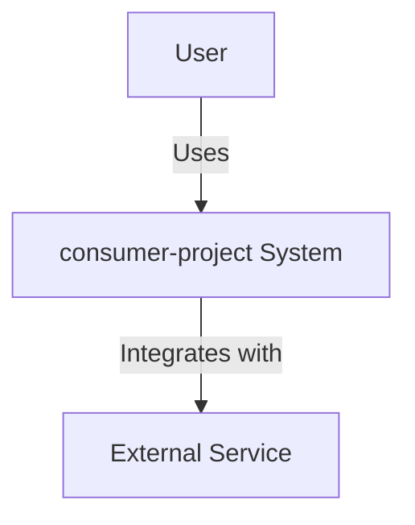

# Gate 40: Architectural Review

**Priority:** MANDATORY for major work efforts
**Applies to:** Large features, system-wide changes, multi-component work
**Owner:** Architect role

---

## Overview

After completing major work efforts, an architectural review MUST be conducted to:
1. Document architectural decisions made during implementation
2. Identify opportunities for large-scale refactoring
3. Assess alignment with system architecture principles
4. Update architectural documentation and diagrams
5. Ensure proper system documentation exists

**Trigger:** When work effort involves:
- Multiple components or services
- New architectural patterns introduced
- Significant changes to system structure
- Integration of new technologies
- Cross-cutting concerns (auth, caching, logging, etc.)

---

## Gate Criteria

### 1. Architectural Decision Records (ADRs)

**REQUIRED:** Document all significant architectural decisions made during implementation.

**ADR Format:**
```markdown
# ADR-{number}: {Short Title}

**Status:** Accepted | Proposed | Deprecated | Superseded
**Date:** YYYY-MM-DD
**Deciders:** [Names/Roles]

## Context
What is the issue we're facing? What factors influence this decision?

## Decision
What architectural decision did we make?

## Consequences
What becomes easier or harder as a result of this decision?

### Positive Consequences
- [Benefit 1]
- [Benefit 2]

### Negative Consequences
- [Trade-off 1]
- [Trade-off 2]

## Alternatives Considered
What other options did we consider and why were they rejected?

## Related Decisions
- ADR-{number}: {Related decision}
```

**Location:** `docs/adr/ADR-{number}-{title}.md`

**Examples of decisions requiring ADRs:**
- Choosing GraphQL vs REST for API layer
- Selecting state management approach (Redux, Context, etc.)
- Database technology choice
- Authentication/authorization strategy
- Caching strategy and technology
- Deployment architecture
- Service boundaries and communication patterns

### 2. Architecture Documentation

**REQUIRED:** Update system architecture documentation to reflect current state.

**Documentation Requirements:**

**A. System Overview** (`docs/architecture/system-overview.md`)
- High-level architecture diagram
- Component responsibilities
- Technology stack
- Integration points
- Data flow overview

**B. Component Documentation** (`docs/architecture/components/{component}.md`)
- Component purpose and responsibilities
- Public interfaces/APIs
- Dependencies (internal and external)
- Data models
- Configuration
- Deployment considerations

**C. Architecture Diagrams**
- C4 Model diagrams (Context, Container, Component, Code)
- Sequence diagrams for critical flows
- Data flow diagrams
- Deployment architecture
- Network topology (if applicable)

**Diagram Format:** Mermaid, PlantUML, or exported images with source

**Example C4 Context Diagram (Mermaid):**


### 3. Refactoring Opportunities

**REQUIRED:** Identify and document opportunities for improvement.

**Assessment Areas:**
- **Code Duplication:** Repeated patterns that could be abstracted
- **Architectural Debt:** Components that don't align with current patterns
- **Performance Bottlenecks:** Areas requiring optimization
- **Scalability Concerns:** Components that may not scale
- **Maintainability Issues:** Complex or hard-to-understand areas
- **Technology Debt:** Outdated dependencies or patterns

**Documentation Format:**
```markdown
# Refactoring Opportunities

## High Priority
### Opportunity 1: [Title]
**Impact:** [Performance | Maintainability | Scalability | etc.]
**Effort:** [Low | Medium | High]
**Description:** [What needs refactoring and why]
**Proposed Approach:** [How to address it]

## Medium Priority
[...]

## Low Priority / Future Considerations
[...]
```

**Location:** `docs/architecture/refactoring-opportunities.md`

### 4. System Quality Assessment

**REQUIRED:** Assess current system against quality attributes.

**Quality Attributes to Review:**
- **Performance:** Response times, throughput, resource usage
- **Scalability:** Ability to handle growth
- **Reliability:** Error handling, fault tolerance, recovery
- **Security:** Authentication, authorization, data protection
- **Maintainability:** Code clarity, documentation, test coverage
- **Observability:** Logging, monitoring, debugging capabilities

**Assessment Format:**
```markdown
## [Quality Attribute]
**Current State:** [Description]
**Target State:** [Where we want to be]
**Gap Analysis:** [What's missing]
**Recommendations:** [Actions to close gap]
```

---

## Process

### Phase 1: Data Collection

1. **Review completed work:**
   - Read all work logs and implementation notes
   - Review code changes (git diff, PR descriptions)
   - Examine test coverage and quality reports
   - Check performance metrics if available

2. **Interview stakeholders:**
   - Engineers who implemented the work
   - Reviewers who assessed quality
   - Users of the component (if applicable)

3. **Analyze system state:**
   - Current architecture vs intended architecture
   - Integration points and dependencies
   - Data flows and communication patterns

### Phase 2: Analysis

1. **Identify architectural decisions made:**
   - Explicit decisions (documented during work)
   - Implicit decisions (visible in code/structure)
   - Deferred decisions (TODOs, FIXMEs)

2. **Assess alignment with principles:**
   - Does implementation follow established patterns?
   - Are there deviations? Are they justified?
   - Are new patterns introduced? Should they become standard?

3. **Identify improvement opportunities:**
   - Technical debt introduced
   - Existing debt that could be addressed
   - Patterns that should be refactored
   - Areas lacking clarity or documentation

### Phase 3: Documentation

1. **Write ADRs for significant decisions**
2. **Update architecture diagrams**
3. **Update component documentation**
4. **Document refactoring opportunities**
5. **Update system quality assessment**

### Phase 4: Review and Approval

1. **Present findings to team:**
   - Architecture diagrams
   - Key decisions and trade-offs
   - Refactoring recommendations

2. **Gather feedback:**
   - Technical accuracy
   - Completeness
   - Prioritization of refactoring

3. **Finalize documentation:**
   - Incorporate feedback
   - Commit to repository
   - Link from main README or docs index

---

## Tools and Templates

### ADR Template
Location: `templates/architecture/adr-template.md`

### Architecture Diagram Tools
- **Mermaid:** In-code diagrams (recommended for maintainability)
- **PlantUML:** UML diagrams
- **Draw.io / Lucidchart:** For complex diagrams
- **C4 Model:** Use C4 notation for clarity

### Documentation Structure
```
docs/
├── architecture/
│   ├── README.md (index of all architecture docs)
│   ├── system-overview.md
│   ├── decisions/
│   │   ├── ADR-001-api-technology.md
│   │   ├── ADR-002-auth-strategy.md
│   │   └── ...
│   ├── components/
│   │   ├── frontend.md
│   │   ├── backend-api.md
│   │   ├── backend-graphql.md
│   │   └── ...
│   ├── diagrams/
│   │   ├── c4-context.mmd
│   │   ├── c4-container.mmd
│   │   └── ...
│   └── refactoring-opportunities.md
```

---

## Exemptions

This gate may be **skipped** if:
- Work is a small bug fix (< 3 files changed, no architectural impact)
- Work is purely cosmetic (UI tweaks, styling)
- Work is documentation-only
- Architectural review was completed mid-implementation (pre-approved)

**User approval required** to skip this gate for work that meets trigger criteria.

---

## Integration with Orchestrator

When orchestrator detects work effort completion that triggers this gate:

1. **Check trigger criteria:**
   - Multiple components modified?
   - New patterns introduced?
   - Significant structural changes?

2. **If triggered, delegate to Architect:**
   ```python
   Task(subagent_type="general-purpose",
        description="Architectural review of [work effort]",
        prompt="Act as Architect role. Perform architectural review per gate/40-architectural-review.md. Produce ADRs, update architecture docs, identify refactoring opportunities.",
        )
   ```

3. **Verify outputs:**
   - ADRs written for all significant decisions
   - Architecture diagrams updated
   - Component documentation current
   - Refactoring opportunities documented

4. **User review:**
   - Present architectural review findings
   - Discuss refactoring priorities
   - Get approval to proceed or address concerns

---

## Benefits

1. **Long-term Maintainability:**
   - Decisions are documented and understood
   - New team members can understand rationale
   - Prevents "tribal knowledge" loss

2. **Continuous Improvement:**
   - Refactoring opportunities identified systematically
   - Technical debt tracked and prioritized
   - System quality trends visible

3. **Alignment:**
   - Ensures implementation matches architectural vision
   - Identifies architectural drift early
   - Maintains consistency across system

4. **Knowledge Sharing:**
   - Architecture documentation benefits entire team
   - Diagrams provide shared mental models
   - Decisions are transparent and traceable

---

## Example Checklist

After completing major work effort:

- [ ] All significant architectural decisions documented as ADRs
- [ ] System overview diagram updated (if affected)
- [ ] Component diagrams updated (if affected)
- [ ] Sequence diagrams created for new critical flows
- [ ] Component documentation updated
- [ ] Refactoring opportunities identified and documented
- [ ] System quality assessment updated
- [ ] Documentation committed to repository
- [ ] Architecture review presented to team
- [ ] Feedback incorporated
- [ ] User approval obtained

---

**This gate ensures the system remains understandable, maintainable, and aligned with architectural principles as it evolves.**
